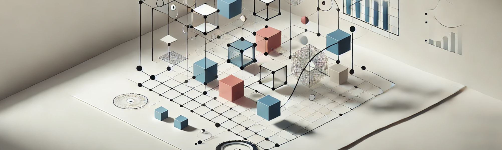

# 8. Entendiendo los Fundamentos: ¿Qué es el Diseño Paramétrico?

El diseño paramétrico es un enfoque avanzado dentro de la arquitectura y el diseño que se caracteriza por la utilización de parámetros y
algoritmos para generar formas y estructuras. Este enfoque representa un cambio fundamental en la manera de concebir y desarrollar los proyectos,
ya que, en lugar de diseñar elementos estáticos y predefinidos, el diseñador establece una serie de reglas o parámetros que permiten crear
soluciones dinámicas, flexibles y adaptables a las circunstancias específicas de cada proyecto. Este proceso es guiado por herramientas
digitales y computacionales que hacen posible la manipulación de grandes cantidades de datos y variables, lo que resulta en diseños más precisos,
eficientes y, en muchos casos, innovadores.

En términos más concretos, el diseño paramétrico se basa en la idea de que un objeto o espacio puede definirse a partir de ciertos parámetros o
variables, tales como dimensiones, proporciones, materiales o condiciones ambientales. Estas variables son interdependientes, lo que
significa que cualquier cambio en un parámetro afecta al conjunto del diseño, generando automáticamente una nueva versión del mismo. Por
ejemplo, un diseñador de interiores que esté creando un mobiliario parametrizado puede definir la altura, el ancho y el ángulo de una mesa
mediante ecuaciones. Si uno de estos parámetros cambia, como la altura, el diseño se ajusta automáticamente en base a las reglas establecidas.
Esta capacidad de generar múltiples variaciones a partir de un solo modelo base proporciona una flexibilidad sin precedentes y permite una
rápida iteración durante el proceso de diseño.

El término "paramétrico" proviene de la matemática y la geometría, disciplinas en las que los parámetros son variables que influyen en la
definición de una función o conjunto de funciones. En el contexto del diseño, esto implica que el diseñador no crea únicamente formas
predefinidas, sino que establece relaciones matemáticas entre los diferentes componentes del diseño, permitiendo así un control mucho más
detallado y adaptable. El diseñador no es el único que toma decisiones sobre la forma final; las reglas paramétricas que ha definido interactúan
entre sí para producir un resultado que puede ser revisado y optimizado continuamente. De esta manera, el proceso de diseño deja de ser un
ejercicio de determinación estática y se convierte en un diálogo constante entre el diseñador y el sistema paramétrico.

Uno de los aspectos clave que distingue el diseño paramétrico es su enfoque en la relación entre forma y función. Tradicionalmente, los
diseñadores han trabajado dentro de los límites impuestos por las técnicas de representación gráfica manual o digital, donde cada línea,
curva o volumen debía ser trazado y ajustado manualmente. El diseño paramétrico elimina estas limitaciones al permitir que las formas se
generen en función de las necesidades del proyecto. Si bien esto puede parecer una ventaja puramente estética, en realidad tiene profundas
implicaciones funcionales. Al trabajar con parámetros que pueden incluir restricciones estructurales, condiciones climáticas, flujos de usuarios y
eficiencia energética, los diseñadores pueden crear soluciones espaciales y arquitectónicas que no solo sean visualmente atractivas,
sino también altamente eficientes y sostenibles.

El papel de la tecnología es fundamental en este proceso. Herramientas de software como Grasshopper, Rhino, Revit, y otros programas de modelado
algorítmico, han sido desarrolladas específicamente para facilitar la creación de diseños paramétricos. Estas herramientas permiten al
diseñador definir las reglas paramétricas y observar cómo el diseño evoluciona en tiempo real a medida que se modifican los parámetros. Esta
capacidad para visualizar y ajustar los resultados en el momento también cambia la dinámica del proceso creativo, ya que el diseñador no está
limitado por las convenciones tradicionales de representación gráfica, sino que puede explorar más libremente soluciones formales y espaciales.
Además, la tecnología paramétrica facilita la integración de análisis complejos en el proceso de diseño, como la simulación de comportamiento
estructural, la eficiencia energética y la iluminación natural.

El diseño paramétrico, sin embargo, no es solo una cuestión de formas complejas o estética avanzada. Se trata de una metodología que permite
optimizar los diseños en función de criterios específicos y resolver problemas que van más allá de lo visual. En el diseño de interiores, por
ejemplo, el enfoque paramétrico puede ser utilizado para crear soluciones adaptativas que respondan a las necesidades cambiantes de los
usuarios o las condiciones del entorno. En un espacio comercial, por ejemplo, los parámetros podrían incluir la afluencia de personas, los
patrones de circulación y la interacción con el mobiliario, lo que permitiría generar un diseño que se ajuste automáticamente a estas
variables para mejorar la experiencia del usuario y maximizar la funcionalidad del espacio. Del mismo modo, en un proyecto residencial,
los parámetros podrían incluir la cantidad de luz natural disponible, el clima local y las preferencias de los residentes, lo que resultaría en un
diseño más personalizado y eficiente.

Una de las aplicaciones más interesantes del diseño paramétrico es su capacidad para generar formas orgánicas y geométricamente complejas, que
de otro modo serían difíciles, si no imposibles, de diseñar mediante métodos convencionales. Las formas generadas paramétricamente a menudo
imitan patrones encontrados en la naturaleza, lo que les otorga una cualidad orgánica y fluida. Esto ha sido aprovechado por arquitectos y
diseñadores para crear estructuras arquitectónicas y mobiliario que no solo son visualmente impactantes, sino también funcionalmente eficientes.
Estos patrones naturales son a menudo más eficientes desde un punto de vista estructural y energético, lo que refuerza el papel del diseño
paramétrico en la creación de soluciones sostenibles.

En última instancia, el diseño paramétrico no es simplemente una nueva herramienta en el arsenal del diseñador, sino un enfoque que cambia la
manera en que se conceptualizan y desarrollan los proyectos. Para arquitectos, creativos, técnicos y diseñadores de interiores, la adopción
de esta metodología implica una redefinición de su papel en el proceso de diseño. Ya no se trata solo de trazar líneas y dar forma a los
espacios de manera manual, sino de convertirse en un creador de sistemas complejos que pueden evolucionar y adaptarse a través del tiempo. Esto
también tiene implicaciones más amplias en la colaboración interdisciplinaria, ya que el diseño paramétrico permite integrar más
fácilmente datos de diversas disciplinas, como la ingeniería estructural, la biología o la física, lo que resulta en un enfoque más
holístico e integrado del diseño.

En conclusión, entender los fundamentos del diseño paramétrico es esencial para cualquier profesional que desee mantenerse a la vanguardia
de la innovación en el ámbito del diseño arquitectónico y de interiores. Este enfoque no solo proporciona nuevas herramientas para la creación de
formas y espacios, sino que también transforma el proceso creativo en sí mismo, permitiendo un mayor grado de experimentación, optimización y
adaptabilidad. A medida que las tecnologías continúan evolucionando y las demandas de los clientes se vuelven más complejas, el diseño
paramétrico se perfila como una de las metodologías más poderosas y versátiles para abordar los retos contemporáneos en el diseño.