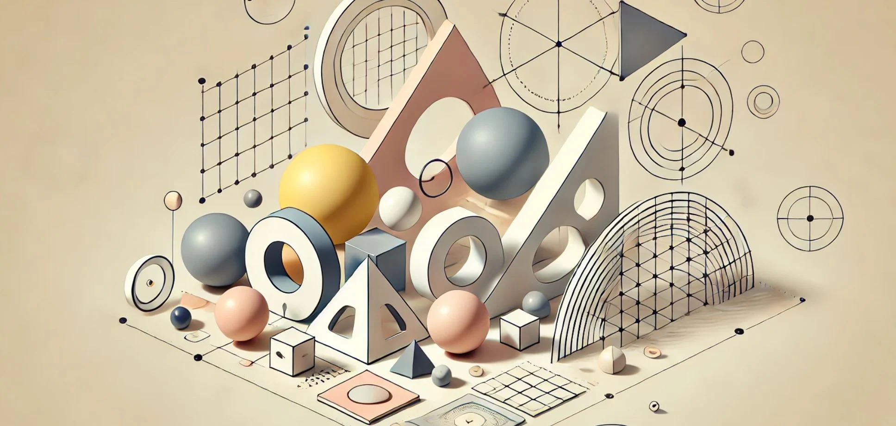

# 12. Geometría Básica: Explorando Formas y Estructuras

La geometría básica es el cimiento sobre el cual se erige todo el diseño paramétrico, y su exploración nos permite entender cómo las formas y
estructuras más simples pueden transformarse en elementos complejos a través de la manipulación de parámetros. Para arquitectos, creativos,
técnicos y diseñadores de interiores, comprender y dominar las formas geométricas básicas es esencial para aplicar de manera efectiva el
enfoque paramétrico, ya que estas formas son los bloques constructivos que se combinan y manipulan en el proceso de diseño.

En el diseño paramétrico, las formas geométricas básicas como el cubo, la esfera, el cilindro, el cono y la pirámide adquieren una nueva
dimensión. En lugar de ser formas fijas y predefinidas, se convierten en objetos dinámicos, cuyas propiedades, como el tamaño, las proporciones y
la orientación, pueden ser controladas y modificadas a través de parámetros. Esto significa que, aunque el punto de partida sea una forma
simple, el diseñador puede generar variaciones infinitas de esa forma ajustando las variables que la definen.

## El Cubo y el Prisma: De la Simplicidad a la Complejidad Paramétrica

El cubo es una de las formas geométricas más básicas y también una de las más versátiles en el diseño paramétrico. A nivel conceptual, se
define por tres dimensiones: ancho, largo y altura, todas ellas parametrizables. En un diseño tradicional, estas dimensiones se fijan
desde el principio y cualquier cambio requiere una modificación manual del modelo. En cambio, en el diseño paramétrico, el cubo es una entidad
que puede modificarse dinámicamente al ajustar los parámetros que definen sus dimensiones. Esto significa que el cubo puede evolucionar a
lo largo del proceso de diseño, adoptando diferentes formas sin necesidad de redibujarlo por completo.

Un prisma rectangular, por ejemplo, puede derivarse de un cubo simplemente ajustando sus dimensiones de manera desigual. Mientras que un
cubo tiene todas sus caras del mismo tamaño, un prisma rectangular puede tener una altura significativamente mayor que su ancho o largo, lo que lo
convierte en una forma más alargada o compacta. A través de la parametrización, el diseñador tiene el control total sobre estas
proporciones, lo que le permite adaptar la forma a las necesidades específicas del proyecto.

El siguiente paso en la exploración de la geometría básica es añadir complejidad a la forma. Una manera de hacerlo es subdividir las caras del
cubo o prisma en secciones más pequeñas, creando una cuadrícula de subdivisión. Estas divisiones permiten generar formas más detalladas y
agregan un nivel adicional de flexibilidad. Por ejemplo, un cubo subdividido puede ser transformado en una estructura modular donde cada
uno de sus componentes puede ser modificado de manera independiente. Esto es especialmente útil en el diseño de interiores, donde las
subdivisiones de las superficies pueden influir en la disposición del mobiliario, la iluminación o los acabados decorativos.

La Esfera y las Superficies Curvas: Exploración Orgánica
La esfera, a diferencia del cubo, introduce la curva como un elemento esencial en la geometría. En el diseño paramétrico, una esfera se define por su radio, pero este valor puede ser parametrizado para generar una amplia gama de variaciones formales. Aunque en su forma más simple, la esfera es una figura perfectamente simétrica, al manipular sus parámetros se pueden obtener geometrías más complejas como elipsoides, esferas achatadas o estiradas, o incluso formas asimétricas que retienen ciertas características esféricas pero presentan deformaciones controladas.

La esfera es especialmente interesante en el diseño paramétrico debido a su capacidad para integrarse en geometrías orgánicas. Mediante la
aplicación de parámetros adicionales, como la subdivisión de su superficie o la manipulación de su curvatura, la esfera puede convertirse
en una estructura con múltiples aplicaciones. Un ejemplo común en el diseño paramétrico es la creación de fachadas o estructuras basadas en
geometrías esféricas que varían en densidad o curvatura según las condiciones ambientales o funcionales.

Además, la esfera puede combinarse con otras formas básicas para generar estructuras más complejas. Un ejercicio paramétrico clásico consiste en
fusionar una esfera con un cilindro o cono, creando una forma híbrida en la que se combinan superficies curvas y planas. Este tipo de exploración
es particularmente útil en el diseño de mobiliario o elementos decorativos, donde las formas fluidas y orgánicas a menudo se integran
con elementos estructurales más rectilíneos.

## El Cilindro y el Cono: Formas Estructurales y Volúmenes de Rotación

El cilindro es otra forma geométrica fundamental que, al igual que el cubo, puede parametrizarse en términos de su altura y radio. En el diseño
paramétrico, los cilindros no solo se utilizan como volúmenes simples, sino que a menudo se manipulan para crear formas más complejas a través
de la torsión, la curvatura o la segmentación. Por ejemplo, un cilindro parametrizado puede ser torcido en su eje vertical, generando una
estructura en espiral o helicoidal. Estas formas son comunes en la arquitectura contemporánea, donde las torres o pilares con curvatura son
elementos icónicos de muchos proyectos paramétricos.

El cono, por su parte, es una forma más compleja, ya que introduce el concepto de convergencia hacia un punto o vértice. Al igual que el
cilindro, el cono puede parametrizarse en función de su altura y radio, pero también puede manipularse para alterar la pendiente de sus lados o
el punto en el que convergen. Este tipo de manipulación permite crear estructuras que se expanden o se contraen de manera fluida, lo que es
útil en el diseño de elementos como columnas, techos o elementos de iluminación.

El cono y el cilindro, además, ofrecen interesantes oportunidades para la creación de volúmenes de rotación. Al parametrizar la rotación de una
curva alrededor de un eje, el diseñador puede generar formas simétricas pero con una mayor complejidad formal que las versiones básicas de estas
figuras. Estas geometrías de rotación son especialmente útiles en proyectos que requieren una gran simetría, como en el diseño de espacios
ceremoniales o religiosos, o en la creación de mobiliario de formas fluidas.

## La Pirámide y las Formas Poligonales

Finalmente, la pirámide y las formas poligonales representan otra categoría de geometrías básicas que se pueden explorar en el diseño
paramétrico. La pirámide es una estructura que se define por una base poligonal y un punto o vértice superior hacia el cual convergen las
caras. Al parametrizar tanto la base como la altura de la pirámide, el diseñador puede generar una amplia variedad de formas, desde pirámides
regulares con simetría perfecta hasta pirámides asimétricas o con bases irregulares.

Además, las formas poligonales que sirven como base para las pirámides pueden ser manipuladas paramétricamente para alterar su número de lados,
su tamaño o su orientación. Esta capacidad de manipulación permite crear geometrías complejas y no convencionales que pueden ser aplicadas en el
diseño de techos, fachadas o mobiliario. Las formas poligonales son especialmente útiles en proyectos que requieren un alto grado de
personalización, ya que permiten adaptar las proporciones y los ángulos de las superficies según las necesidades específicas del proyecto.

## Combinación y Experimentación

Uno de los aspectos más interesantes del diseño paramétrico es la capacidad de combinar diferentes formas básicas para crear geometrías
híbridas y estructuras más complejas. Un proyecto básico de exploración geométrica podría comenzar con un cubo, una esfera y un cilindro, pero al
combinar estos elementos en un solo modelo, el diseñador puede generar formas completamente nuevas. La intersección, la unión y la resta de
volúmenes son operaciones fundamentales en el diseño paramétrico que permiten a los diseñadores experimentar con formas que se entrelazan,
fusionan o interactúan entre sí de manera fluida.

Por ejemplo, una esfera podría intersectar con un cubo para crear una cavidad esférica dentro de una estructura cúbica, o un cilindro podría
ser restado de una pirámide para generar una apertura o una ventana. Estas operaciones permiten a los diseñadores explorar cómo diferentes
formas y estructuras pueden coexistir en un mismo espacio, generando diseños más complejos y sofisticados.

La exploración de formas y estructuras básicas en el diseño paramétrico es el primer paso hacia la creación de proyectos más ambiciosos y
detallados. A través de la manipulación de parámetros, los diseñadores pueden transformar formas simples como cubos, esferas, cilindros y
pirámides en estructuras dinámicas y adaptativas, capaces de responder a las necesidades funcionales y estéticas de cualquier proyecto. Esta
capacidad de experimentación y generación de variaciones es lo que hace del diseño paramétrico una herramienta tan poderosa para arquitectos,
creativos, técnicos y diseñadores de interiores, ya que permite un nivel de personalización y flexibilidad que sería difícil de lograr con métodos
de diseño tradicionales.