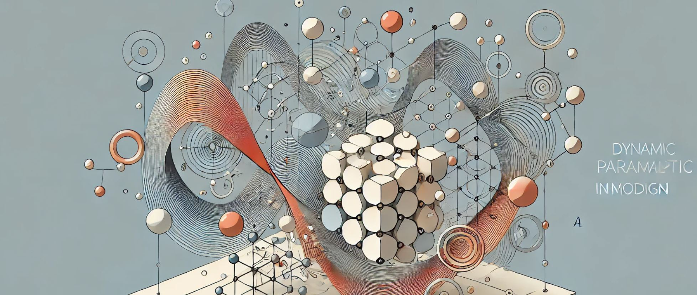

## 14. Dinámica de los Modelos Paramétricos: Más allá de lo Básico

La dinámica de los modelos paramétricos va más allá de la simple manipulación de formas básicas; involucra una serie de principios y
técnicas que permiten a los diseñadores explorar nuevas fronteras en la creación de estructuras, espacios y objetos. En este contexto, “dinámica”
no se refiere únicamente al cambio o la adaptabilidad de las formas, sino también a cómo los diferentes parámetros interactúan de manera
fluida para generar soluciones innovadoras y a menudo inesperadas. Para arquitectos, creativos, técnicos y diseñadores de interiores, la
verdadera potencia del diseño paramétrico radica en su capacidad para modelar no solo geometrías complejas, sino también comportamientos,
condiciones ambientales y respuestas contextuales.

## Modelos dinámicos: Flexibilidad y adaptabilidad

Uno de los conceptos más fascinantes en el diseño paramétrico es el de la adaptabilidad dinámica. A diferencia de los métodos tradicionales,
donde un cambio en el diseño puede requerir ajustes manuales costosos en tiempo y recursos, los modelos paramétricos permiten que el diseño se
adapte de manera automática cuando se alteran las condiciones de entrada. Esto se debe a que los parámetros no actúan de manera aislada;
están interrelacionados y, por lo tanto, cualquier cambio en un parámetro puede influir en toda la geometría o estructura del modelo.
Esta interdependencia es lo que confiere flexibilidad al proceso de diseño y es fundamental para la creación de modelos dinámicos.

Un ejemplo de esta adaptabilidad puede encontrarse en el diseño arquitectónico de fachadas. Un modelo paramétrico de fachada puede estar
vinculado a factores como la incidencia de la luz solar, la orientación del edificio o la temperatura ambiente. A medida que estos factores
cambian (por ejemplo, con el paso de las estaciones o el movimiento del sol a lo largo del día), el modelo paramétrico puede ajustar
automáticamente las características de la fachada, como el tamaño y la inclinación de los paneles de sombreado o la disposición de las aperturas
para maximizar la eficiencia energética. Esta adaptabilidad no solo hace que el diseño sea más eficiente, sino que también genera un lenguaje
visual único, donde la forma de la arquitectura responde de manera fluida a su entorno.

## Interacción entre múltiples parámetros

Uno de los aspectos clave de los modelos paramétricos es la interacción entre múltiples parámetros, lo que permite generar resultados complejos a
partir de relaciones relativamente simples. Mientras que en el diseño básico se podría trabajar con parámetros individuales que afectan solo a
una característica del objeto, en modelos más avanzados, varios parámetros pueden influir en múltiples aspectos del diseño simultáneamente.

Por ejemplo, en el diseño de interiores, se puede parametrizar un mobiliario de tal forma que la altura de una mesa esté relacionada con la
inclinación de sus patas y con el espesor del material utilizado. Al ajustar la altura, las patas se ajustan proporcionalmente para mantener
la estabilidad, mientras que el espesor del material cambia automáticamente para asegurar que la estructura pueda soportar el peso
requerido. En este escenario, tres parámetros diferentes están interrelacionados para garantizar que el diseño mantenga su funcionalidad
y estética a pesar de las modificaciones. Este tipo de relaciones dinámicas permite a los diseñadores mantener la coherencia en sus
proyectos mientras exploran diferentes variaciones formales.

## Respuesta contextual: Modelos que reaccionan al entorno

Otro aspecto fascinante del diseño paramétrico avanzado es la capacidad de generar modelos que reaccionan a condiciones contextuales. En este
caso, los parámetros no están definidos de manera fija, sino que se controlan mediante datos externos. Estos datos pueden provenir de
sensores en tiempo real, simulaciones ambientales o incluso comportamientos de los usuarios. El resultado es un diseño que no solo es
flexible en cuanto a su geometría, sino que también puede adaptarse de manera inteligente a cambios en su entorno.

Un ejemplo típico de esto es el diseño de techos o estructuras de sombreado que responden a las condiciones climáticas. A través de la
manipulación de parámetros relacionados con la posición del sol, la temperatura o la velocidad del viento, es posible diseñar estructuras
paramétricas que se abren o cierran, giran o ajustan su ángulo para optimizar la ventilación o la protección solar en un espacio. Estos
modelos pueden generar respuestas adaptativas que no solo mejoran el confort de los usuarios, sino que también contribuyen a la eficiencia
energética del edificio.

En el ámbito del diseño de interiores, este enfoque puede aplicarse a elementos como las cortinas o persianas automatizadas, donde los parámetros que controlan su apertura o cierre pueden depender de la cantidad de luz natural que entra en la habitación, la temperatura interna o incluso las preferencias de los usuarios. Este tipo de sistemas adaptativos crea un entorno de vida más cómodo y eficiente, donde los elementos del espacio interior responden automáticamente a las condiciones cambiantes.

## Complejidad formal: Exploración de geometrías avanzadas

La dinámica en el diseño paramétrico no solo se refiere a la capacidad de adaptarse al entorno o a las condiciones de entrada; también implica
la posibilidad de generar geometrías extremadamente complejas mediante la manipulación de parámetros interrelacionados. A medida que se
introducen más parámetros y se definen relaciones más elaboradas entre ellos, los diseñadores pueden crear formas que van mucho más allá de lo
que es posible mediante técnicas tradicionales de modelado.

Por ejemplo, la creación de superficies curvas complejas, como aquellas basadas en geometrías orgánicas o biomiméticas, es uno de los puntos
fuertes del diseño paramétrico. Estas superficies pueden generarse a partir de ecuaciones matemáticas o algoritmos que simulan el crecimiento
de estructuras naturales, como las conchas o los huesos. Al modificar los parámetros que controlan estos algoritmos, los diseñadores pueden
explorar una gran cantidad de variaciones formales, desde formas fluidas hasta estructuras más rígidas y angulares, todo sin necesidad de
redibujar el modelo.

Este enfoque es particularmente valioso en el diseño arquitectónico, donde las superficies curvas o las formas no euclidianas pueden optimizar
la eficiencia estructural o mejorar el rendimiento acústico y térmico. Los diseñadores pueden explorar estas posibilidades parametrizando no
solo la geometría, sino también las propiedades materiales y estructurales del modelo. Por ejemplo, al diseñar una cúpula paramétrica,
es posible ajustar el grosor de la estructura en función de las cargas que debe soportar, o variar la densidad de los elementos estructurales en
función de las zonas de mayor o menor esfuerzo.

## Animación y tiempo: Modelos paramétricos en movimiento

La animación y la manipulación del tiempo son otro aspecto crucial en la dinámica de los modelos paramétricos avanzados. No solo se trata de crear
formas que cambian en función de las entradas estáticas, sino también de generar modelos que evolucionen a lo largo del tiempo. Esta capacidad es
especialmente útil en proyectos que involucran movimiento, ya sea de los usuarios, de las condiciones ambientales o de los propios elementos del
diseño.

Un ejemplo típico de esto son las estructuras cinéticas en la arquitectura, donde los parámetros que controlan la geometría del
edificio están vinculados al tiempo o a datos en tiempo real. En estos casos, los parámetros pueden hacer que una fachada o una estructura
cambie de forma a lo largo del día, adaptándose a las condiciones climáticas o a las necesidades de los usuarios. Esta capacidad de
respuesta temporal añade una nueva dimensión al diseño, donde los espacios ya no son estáticos, sino que se transforman continuamente para
optimizar su funcionalidad.

En el diseño de interiores, la manipulación del tiempo puede aplicarse al mobiliario o a las configuraciones espaciales que cambian en función
del uso del espacio. Por ejemplo, una mesa parametrizada podría ajustarse automáticamente a diferentes alturas a lo largo del día para
adaptarse a diferentes actividades, como reuniones, trabajo o comidas. La manipulación de parámetros en función del tiempo permite crear
espacios más dinámicos y adaptativos, mejorando la experiencia del usuario.

## Inteligencia algorítmica: Scripting y automatización avanzada

A medida que los diseñadores avanzan en el uso del diseño paramétrico, el scripting y la programación algorítmica se convierten en herramientas
esenciales para manipular modelos más complejos. El scripting permite a los diseñadores definir reglas y relaciones más detalladas entre los
parámetros, así como automatizar tareas repetitivas o generar variaciones formales a gran escala. Programas como **Grasshopper** o
**Dynamo** permiten crear sistemas de diseño altamente personalizados, donde cada aspecto del modelo puede estar controlado por un algoritmo.

El uso de scripting no solo aumenta la capacidad de generar formas complejas, sino que también permite integrar datos externos en el modelo
paramétrico. Por ejemplo, es posible utilizar datos de simulaciones climáticas o de comportamiento de los usuarios para controlar cómo se
genera y modifica la geometría. Este enfoque basado en datos no solo optimiza el rendimiento del diseño, sino que también crea un sistema en
el que el modelo evoluciona en función de variables externas, lo que lo convierte en un proceso de diseño más inteligente y adaptativo.

## Conclusión

Los modelos paramétricos dinámicos ofrecen a los diseñadores una poderosa herramienta para ir más allá de las formas básicas y explorar un
mundo de posibilidades que abarca la adaptabilidad, la respuesta contextual, la complejidad formal y el control temporal. A través de la
manipulación de parámetros interrelacionados, los diseñadores pueden crear estructuras y espacios que no solo sean estéticamente atractivos,
sino también funcionales y eficientes en respuesta a su entorno y a las necesidades de los usuarios.