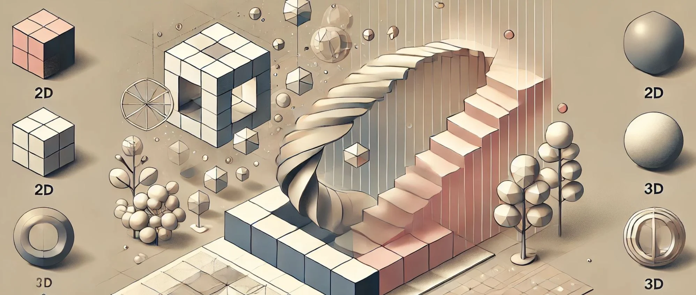

# 15. De 2D a 3D: Transformaciones y Transiciones

La transición del diseño en 2D al mundo tridimensional es un paso crucial en el proceso de creación paramétrica, especialmente para
arquitectos, creativos, técnicos y diseñadores de interiores que buscan transformar conceptos bidimensionales en formas y estructuras
tridimensionales complejas. Este cambio de plano no solo implica la adición de una dimensión física, sino también un cambio profundo en la
manera en que se concibe y desarrolla el diseño. A través de las transformaciones paramétricas, las líneas y las superficies en 2D se
convierten en volúmenes y estructuras dinámicas en 3D, permitiendo un nivel de adaptabilidad y flexibilidad que no se encuentra en las técnicas
de diseño convencionales.

## El poder de las curvas y los contornos: La base en 2D

El punto de partida para muchas geometrías tridimensionales en el diseño paramétrico es una forma bidimensional básica, como un contorno, una
curva o un perfil. Las líneas y curvas en 2D no solo representan la estructura básica del diseño, sino que también contienen la información
necesaria para determinar cómo se comportarán y transformarán en el espacio tridimensional. La capacidad de parametrizar y manipular estas
formas en 2D antes de su transición al 3D permite a los diseñadores explorar una amplia gama de variaciones formales antes de definir la
forma final.

Una de las técnicas más comunes para pasar del 2D al 3D es la **extrusión**, un proceso en el que un contorno o perfil en 2D se
"estira" a lo largo de una tercera dimensión para generar un volumen tridimensional. Por ejemplo, un simple cuadrado en 2D puede ser extruido
verticalmente para generar un prisma rectangular, o una curva cerrada puede ser extruida para formar un tubo o cilindro. Esta técnica básica es
fundamental en la creación de formas tridimensionales paramétricas, ya que permite que el perfil bidimensional controle la forma general del
objeto, mientras que la longitud de la extrusión se convierte en otro parámetro que puede manipularse.

Sin embargo, la extrusión es solo el primer paso en la transformación de 2D a 3D. Para lograr formas más complejas y dinámicas, los diseñadores
pueden emplear otras técnicas de transformación, como el **barrido** (sweep), la **revolución** y la **lofting**, cada una de las cuales
proporciona un control más sofisticado sobre la geometría tridimensional que se genera a partir de una base bidimensional.

## Barrido (Sweep): De una curva a un volumen

El **barrido** es una técnica de transformación paramétrica en la que una curva o perfil en 2D se mueve a lo largo de un camino o trayectoria
para generar un volumen tridimensional. Este método es extremadamente flexible y permite crear formas complejas con superficies fluidas y
orgánicas. Por ejemplo, se puede tomar una curva como perfil de sección transversal y "barrerla" a lo largo de una segunda curva que define su
trayectoria en el espacio. El resultado es una forma tridimensional que sigue la geometría de la curva de barrido mientras mantiene las
características del perfil original.

El barrido es particularmente útil en proyectos donde el diseño debe seguir trayectorias no lineales o curvas, como en la creación de
elementos arquitectónicos sinuosos, muebles o estructuras orgánicas. Además, el barrido paramétrico permite variar el perfil a lo largo de la
trayectoria, lo que genera formas aún más complejas. Por ejemplo, el perfil de un mueble puede empezar siendo rectangular en un extremo y
transformarse en ovalado o circular a medida que se mueve a lo largo del recorrido, creando una transición fluida entre diferentes secciones.

El control de los parámetros en el barrido permite modificar tanto la trayectoria como la forma del perfil, lo que genera un grado elevado de
flexibilidad en el diseño. Esta técnica es ideal para la creación de barandillas, elementos de mobiliario, techos ondulantes o cualquier
estructura que requiera una transición suave entre diferentes geometrías a lo largo de un recorrido específico.

## Revolución: Rotación de un perfil en 2D

Otra técnica clave en la transformación de geometrías 2D a 3D es la **revolución**, en la que un perfil bidimensional se rota alrededor de un
eje para generar un volumen tridimensional. Este método es particularmente útil para crear formas simétricas, como cilindros,
esferas, conos y otros volúmenes rotacionales. Por ejemplo, una curva parabólica puede rotarse alrededor de un eje vertical para generar un
paraboloide, o una línea recta puede rotarse para crear un cilindro.

La revolución paramétrica no solo permite controlar el perfil que se rota, sino también el ángulo de rotación, el punto de partida y el final
de la rotación. Esto significa que un diseñador puede crear un cono truncado, una esfera parcial o una estructura helicoidal simplemente
ajustando los parámetros de rotación. La capacidad de controlar estos parámetros en tiempo real ofrece una flexibilidad sin precedentes en la
creación de volúmenes tridimensionales precisos y personalizados.

La técnica de revolución es particularmente útil en el diseño de elementos arquitectónicos y decorativos, como columnas, lámparas o
elementos estructurales que requieren una simetría perfecta en torno a un eje. Además, al combinar la revolución con otras técnicas
paramétricas, como la manipulación del perfil antes de rotarlo, los diseñadores pueden generar formas rotacionales con geometrías más
complejas e innovadoras.

## Lofting: Conectando curvas para crear superficies

El **lofting** es una técnica de transformación avanzada que permite crear superficies tridimensionales conectando múltiples curvas o
secciones transversales en 2D. En lugar de extruir un solo perfil o barrerlo a lo largo de una trayectoria, el lofting permite definir varias
curvas en diferentes planos y generar una superficie que fluya suavemente entre ellas. Esta técnica es especialmente útil para la
creación de superficies orgánicas y fluidas que varían de manera progresiva entre diferentes formas.

Por ejemplo, un diseñador puede definir una serie de elipses en diferentes alturas y utilizar la técnica de lofting para generar una
superficie que conecte estas elipses, creando una estructura en forma de cáscara que varía en grosor y curvatura a lo largo de su altura. El
lofting también permite que las secciones transversales no sean uniformes, lo que añade aún más flexibilidad al diseño. Se pueden
conectar perfiles rectos con curvas o incluso con formas cerradas, generando volúmenes que evolucionan de manera suave y continua.

Una de las aplicaciones más comunes del lofting es la creación de techos ondulantes, fachadas curvas o mobiliario con formas ergonómicas. En el
ámbito arquitectónico, el lofting se utiliza a menudo para diseñar estructuras que requieren una transición fluida entre diferentes formas,
como en los proyectos de arquitectura orgánica o biofílica. La capacidad de ajustar los parámetros de las curvas y la forma en que se conectan
permite una exploración continua de las posibilidades formales, adaptando el diseño a las necesidades estéticas y funcionales del proyecto.

## Combinación de técnicas: Transformaciones complejas

El verdadero poder del diseño paramétrico radica en la capacidad de combinar múltiples técnicas de transformación para generar formas
tridimensionales complejas y adaptables. Un ejemplo de esto sería combinar la extrusión de un perfil en 2D con un barrido a lo largo de una
trayectoria curva, generando una estructura tridimensional que no solo tiene volumen, sino que también sigue una trayectoria específica en el
espacio. Del mismo modo, se puede utilizar la técnica de revolución para generar una forma de base, y luego aplicar lofting entre varias secciones
de esa forma para crear una transición fluida y orgánica.

Al combinar estas técnicas, los diseñadores tienen un control total sobre cada aspecto de la forma tridimensional, desde su perfil inicial en
2D hasta su evolución a lo largo del espacio. La manipulación paramétrica permite ajustar cualquier parámetro de manera dinámica, lo
que hace posible experimentar con diferentes configuraciones y generar una gran cantidad de variaciones sin tener que redibujar el modelo desde
cero. Este enfoque no solo ahorra tiempo, sino que también fomenta la creatividad y la experimentación, ya que los diseñadores pueden probar
rápidamente diferentes combinaciones de formas y ver cómo interactúan en el espacio.

## Transiciones dinámicas: La clave de la adaptabilidad

Una de las características más poderosas de los modelos paramétricos es la capacidad de generar **transiciones dinámicas** entre geometrías. A
medida que los diseñadores manipulan los parámetros de un modelo, es posible crear transiciones fluidas entre diferentes estados o formas. Por
ejemplo, un modelo paramétrico de mobiliario podría empezar como una silla y, a través de la manipulación de los parámetros, transformarse en
una mesa, ajustando su altura, proporciones y forma de manera continua.

Estas transiciones no solo son útiles en términos de exploración formal, sino que también pueden mejorar la funcionalidad de los objetos y
espacios diseñados. En el diseño de interiores, por ejemplo, un mueble paramétrico puede ajustarse para cumplir diferentes funciones según las
necesidades del usuario, como pasar de ser una mesa de comedor a una superficie de trabajo ajustando sus dimensiones. Del mismo modo, en
arquitectura, las transiciones dinámicas pueden permitir que las fachadas de un edificio cambien de forma en función de las condiciones
climáticas o las necesidades de iluminación natural.