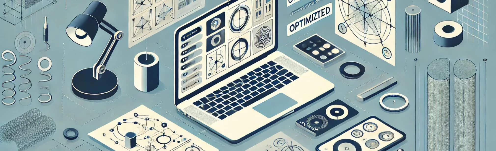

# 16. Revisión y Optimización de Diseños Iniciales

La revisión y optimización de los diseños iniciales es una parte esencial del proceso de diseño paramétrico, especialmente cuando se busca
maximizar la funcionalidad, la eficiencia y la estética de un proyecto. A medida que los arquitectos, creativos, técnicos y diseñadores de
interiores exploran y desarrollan sus conceptos a través de herramientas paramétricas, llega un punto en el que es fundamental evaluar y refinar
esos diseños para garantizar que no solo cumplan con los requisitos del proyecto, sino que también sean sostenibles, adaptativos y viables en
términos constructivos.

El enfoque paramétrico facilita este proceso de revisión, ya que permite que los diseños sean iterativos por naturaleza. Gracias a la manipulación
de parámetros, es posible ajustar fácilmente los aspectos clave de un diseño sin necesidad de empezar desde cero. Sin embargo, para optimizar
un diseño paramétrico, es necesario aplicar una serie de principios y técnicas que van más allá de la mera manipulación de variables, y que
implican una comprensión profunda de los requisitos funcionales, estructurales y estéticos del proyecto.

## Evaluación inicial: Identificación de problemas y oportunidades

El primer paso en la revisión de un diseño paramétrico es la **evaluación inicial**, en la que se identifican posibles problemas o
áreas de mejora. En este punto, es importante analizar el diseño desde diferentes perspectivas: funcionalidad, estructura, estética,
sostenibilidad y viabilidad constructiva. En un modelo paramétrico, estos aspectos suelen estar interrelacionados, lo que significa que un
cambio en un parámetro puede influir en varios aspectos del diseño al mismo tiempo. Esta interdependencia puede ser tanto una ventaja como un
desafío, ya que permite ajustes rápidos, pero también puede generar problemas si no se gestionan adecuadamente.

Por ejemplo, en un proyecto arquitectónico, un parámetro que controla la altura de un edificio puede afectar no solo a la estética, sino también a
la estabilidad estructural y al rendimiento energético del diseño. Al realizar la evaluación inicial, el diseñador debe identificar cualquier
conflicto entre los diferentes parámetros y asegurarse de que los cambios realizados en un aspecto del diseño no comprometan otros aspectos
importantes. Este tipo de análisis puede involucrar simulaciones o cálculos estructurales para verificar que el diseño cumple con los
estándares de seguridad y eficiencia energética.

En el diseño de interiores, la evaluación inicial podría centrarse en aspectos como la ergonomía, la circulación dentro del espacio o la
integración de los muebles parametrizados. Si bien el modelo inicial puede ser visualmente atractivo, la revisión debe asegurar que el espacio
funcione bien para sus usuarios. Esto implica considerar cómo interactúan los diferentes elementos parametrizados dentro del entorno y
asegurarse de que el espacio sea flexible y adaptable a diferentes usos.

## Optimización estructural: Balance entre forma y estabilidad

Uno de los componentes más importantes de la optimización en el diseño paramétrico es la **optimización estructural**, especialmente en
proyectos arquitectónicos y de interiores que implican estructuras complejas. En este caso, el objetivo es encontrar un equilibrio entre la
forma y la estabilidad estructural, de manera que el diseño no solo sea estéticamente atractivo, sino también seguro y viable desde un punto de
vista constructivo.

El diseño paramétrico ofrece la ventaja de integrar simulaciones estructurales directamente en el proceso de diseño. Esto permite al
diseñador realizar ajustes en tiempo real y ver cómo esos cambios afectan a la estabilidad del modelo. Programas como **Grasshopper** y
**Kangaroo** (un plug-in de simulación física para Rhino) permiten realizar simulaciones de cargas estructurales, tensiones y deformaciones,
lo que facilita la optimización de las geometrías para reducir el peso, aumentar la resistencia o mejorar el comportamiento estructural.

Por ejemplo, al diseñar una cubierta paramétrica, se pueden realizar simulaciones para identificar áreas donde la estructura esté sometida a
mayores cargas o esfuerzos. A partir de esta información, el diseñador puede ajustar los parámetros de la estructura, modificando el grosor o la
densidad de los elementos estructurales en esas áreas para mejorar la estabilidad sin añadir peso innecesario. Este proceso de optimización
permite que el diseño sea no solo más eficiente desde un punto de vista estructural, sino también más económico en cuanto al uso de materiales.

## Optimización energética y ambiental

La **optimización energética y ambiental** es otro aspecto clave en la revisión de diseños paramétricos, especialmente en proyectos que buscan
cumplir con estándares de sostenibilidad y eficiencia energética. En este contexto, los modelos paramétricos pueden ser optimizados para
mejorar su rendimiento en términos de iluminación natural, ventilación, aislamiento térmico y consumo energético.

Los parámetros relacionados con la orientación del edificio, la forma de las aberturas, la disposición de los paneles de sombreado o la elección
de materiales pueden ser manipulados para mejorar el comportamiento ambiental del diseño. Herramientas como **Ladybug** y **Honeybee**
(integradas con Grasshopper) permiten realizar análisis ambientales y simulaciones energéticas que ayudan a los diseñadores a optimizar el
rendimiento de sus proyectos. Estas simulaciones pueden evaluar cómo interactúa el edificio con el clima local, cuánta luz natural penetra en
el espacio y qué tan bien ventilado está, lo que permite realizar ajustes en los parámetros para mejorar su comportamiento.

Por ejemplo, en un edificio con una fachada paramétrica, los paneles de sombreado pueden ser ajustados para maximizar la entrada de luz natural
en invierno, cuando es más deseable, y minimizarla en verano, cuando se requiere más sombra. Este tipo de optimización no solo mejora la
eficiencia energética del edificio, sino que también puede contribuir a mejorar el confort térmico de los ocupantes, reduciendo la dependencia de
sistemas de climatización artificial.

En el diseño de interiores, la optimización ambiental podría implicar la selección de materiales parametrizados que mejoren el confort acústico o
térmico del espacio. Un ejemplo sería el uso de paneles acústicos parametrizados que ajusten su densidad o disposición en función de la
absorción del sonido, mejorando la calidad acústica del espacio sin comprometer la estética.

## Refinamiento estético y funcional

Además de los aspectos estructurales y energéticos, la **optimización estética y funcional** es crucial para garantizar que el diseño final
cumpla con los objetivos del proyecto. En este caso, la manipulación paramétrica permite ajustar las proporciones, las formas y la disposición
de los elementos en función de criterios estéticos, pero sin sacrificar la funcionalidad del diseño.

En un diseño de interiores, por ejemplo, la disposición de los muebles parametrizados puede optimizarse para mejorar la circulación dentro del
espacio o para adaptarse a diferentes actividades. Al ajustar los parámetros relacionados con las dimensiones, la altura o la orientación
de los muebles, los diseñadores pueden garantizar que el espacio sea cómodo y eficiente para sus usuarios. En un entorno comercial, esto
podría significar optimizar la disposición de los elementos para facilitar el flujo de clientes o mejorar la visibilidad de productos en
una tienda.

Desde una perspectiva estética, la manipulación de parámetros permite ajustar la proporción y la forma de los elementos visuales para lograr un
equilibrio armónico en el diseño. Por ejemplo, la repetición de patrones geométricos en una fachada puede optimizarse para que el diseño sea
visualmente coherente y equilibrado, mientras que los detalles finos pueden ajustarse para resaltar aspectos clave de la composición visual.

## Optimización de materiales y costos

Otro aspecto importante en la revisión y optimización de los diseños paramétricos es el **control de los costos y la selección de materiales**.
Al ajustar los parámetros de un modelo, los diseñadores pueden optimizar el uso de los materiales, asegurándose de que se utilicen de manera
eficiente sin desperdiciar recursos.

Por ejemplo, en un proyecto arquitectónico, la elección del material puede ser un parámetro en sí mismo. Los diseñadores pueden evaluar
diferentes opciones de materiales en función de su costo, durabilidad, sostenibilidad y estética. Al realizar simulaciones de costos, es posible
ajustar el diseño para reducir el uso de materiales costosos en áreas donde no son necesarios, o para maximizar el uso de materiales reciclados
o sostenibles.

En el diseño paramétrico, también es posible optimizar la fabricación, ajustando los parámetros del diseño para que se adapte a los procesos de
fabricación digital, como la impresión 3D, el corte por láser o la fabricación CNC. Esto permite una mejor integración entre el diseño y la
construcción, garantizando que el proyecto pueda llevarse a cabo de manera eficiente y dentro del presupuesto.

## Pruebas y validación del diseño

El último paso en la revisión y optimización de un diseño paramétrico es la **prueba y validación**. A medida que el diseño se ajusta, es
fundamental realizar pruebas que aseguren que cumple con los requisitos funcionales y estéticos del proyecto. Estas pruebas pueden involucrar
simulaciones estructurales, análisis energéticos o la creación de prototipos físicos.

En el caso de estructuras complejas o innovadoras, la creación de prototipos a escala puede ser útil para validar las soluciones propuestas
y asegurarse de que el diseño funciona como se espera. Los modelos físicos permiten probar el comportamiento estructural, la interacción de
los materiales y la estética general del diseño, proporcionando una retroalimentación valiosa que puede integrarse en la versión final del
modelo paramétrico.

La revisión y optimización de los diseños iniciales en un proyecto paramétrico es un proceso iterativo que requiere un enfoque meticuloso en
varios aspectos: funcionalidad, estructura, sostenibilidad, estética y costos. Gracias a la flexibilidad inherente del diseño paramétrico, los
arquitectos, creativos, técnicos y diseñadores de interiores pueden ajustar continuamente sus modelos para mejorar el rendimiento y la
adaptabilidad, asegurándose de que el proyecto final no solo cumpla con los requisitos técnicos, sino que también aporte soluciones innovadoras y
optimizadas en todos los niveles.