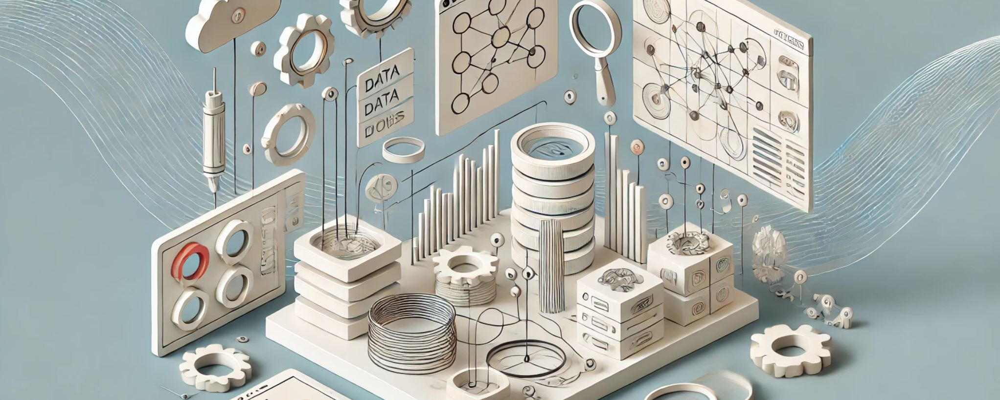

# 18. Integración de Datos en el Diseño: Automatización y Eficiencia

La integración de datos en el diseño paramétrico es una de las grandes fortalezas de este enfoque, permitiendo automatizar procesos y aumentar
significativamente la eficiencia en la creación de proyectos complejos. Al incorporar datos externos o contextuales en el proceso de diseño,
arquitectos, creativos, técnicos y diseñadores de interiores pueden tomar decisiones más informadas y crear soluciones adaptativas que
responden a variables como el clima, el comportamiento de los usuarios, las condiciones del sitio o incluso restricciones presupuestarias. Esta
integración de datos no solo mejora la precisión y funcionalidad de los diseños, sino que también permite automatizar tareas repetitivas,
optimizar recursos y generar resultados más sostenibles.

## El papel de los datos en el diseño paramétrico

En el diseño paramétrico, los datos actúan como **entradas dinámicas** que controlan la forma, función y comportamiento del modelo. A diferencia
del diseño tradicional, donde las variables se definen manualmente y de manera fija, en el diseño paramétrico los datos externos pueden alimentar
los parámetros del modelo, permitiendo que el diseño se ajuste automáticamente a los cambios en esas variables. Los datos pueden
provenir de una variedad de fuentes, como simulaciones climáticas, estudios de comportamiento, bases de datos de materiales o incluso
sistemas de sensores en tiempo real.

Por ejemplo, en un proyecto arquitectónico, los datos climáticos, como la radiación solar, la temperatura y la velocidad del viento, pueden
integrarse en el diseño de una fachada paramétrica. Estos datos guiarán el comportamiento de los elementos de sombreado, la disposición de las
aberturas y la orientación del edificio para optimizar su rendimiento energético. De manera similar, en el diseño de interiores, los datos
sobre el flujo de usuarios pueden informar la disposición del mobiliario o la ubicación de los elementos decorativos, mejorando la funcionalidad y
el confort del espacio.

## Automatización de procesos: Ahorro de tiempo y reducción de errores

Una de las ventajas más importantes de la integración de datos en el diseño paramétrico es la **automatización de procesos**. Las tareas que
antes requerían tiempo y esfuerzo manual pueden ahora automatizarse mediante algoritmos que ajustan automáticamente los parámetros del diseño
en función de los datos recibidos. Esto no solo ahorra tiempo, sino que también reduce el margen de error, ya que las modificaciones se realizan
de manera sistemática y precisa, asegurando la coherencia a lo largo de todo el proyecto.

Un ejemplo de automatización es la generación automática de patrones en una fachada o un mobiliario a partir de datos de comportamiento del
usuario o datos estructurales. Si un diseñador desea crear un patrón de perforaciones en una fachada para optimizar la ventilación natural, los
datos de la dirección y velocidad del viento pueden integrarse directamente en el algoritmo que genera el patrón, de modo que las
perforaciones se ajusten automáticamente para maximizar la ventilación en las áreas donde es más necesario. De esta manera, se elimina la
necesidad de ajustes manuales y se garantiza que el diseño sea óptimo desde el principio.

Otro ejemplo es la automatización en la gestión de **materiales y costos**. Al integrar bases de datos de materiales, los diseñadores
pueden parametrizar la selección de los materiales según criterios como el costo, la sostenibilidad o la durabilidad. Un algoritmo puede comparar
diferentes opciones y sugerir la más eficiente en función de los requisitos del proyecto, asegurando que se mantenga dentro del
presupuesto y minimizando el desperdicio de recursos. Este enfoque no solo mejora la eficiencia, sino que también permite tomar decisiones
informadas y sostenibles desde las primeras etapas del diseño.

## Datos climáticos y simulaciones ambientales

Una de las aplicaciones más poderosas de la integración de datos en el diseño paramétrico es la incorporación de
**datos climáticos y simulaciones ambientales**. Al utilizar estos datos, los diseñadores pueden optimizar sus proyectos para mejorar el
rendimiento energético, maximizar la luz natural o mejorar el confort térmico, entre otros aspectos. Programas como **Ladybug** y **Honeybee**
(que funcionan en Grasshopper y Rhino) permiten realizar simulaciones de comportamiento ambiental y utilizar esos resultados para ajustar
automáticamente los parámetros del diseño.

Por ejemplo, al diseñar un edificio en una región con un clima cálido, los datos de radiación solar pueden integrarse en el modelo paramétrico
para ajustar la posición y tamaño de los elementos de sombreado en función de la orientación del edificio y la hora del día. Del mismo modo,
los datos sobre la velocidad y dirección del viento pueden informar la disposición de las aberturas para optimizar la ventilación cruzada y
reducir la necesidad de sistemas de climatización artificial. Esta capacidad para integrar simulaciones ambientales permite a los
diseñadores no solo mejorar la eficiencia energética de sus proyectos, sino también crear espacios más confortables y sostenibles.

En el diseño de interiores, la integración de datos ambientales también puede ser utilizada para optimizar aspectos como la **acústica** o la
**iluminación natural**. Por ejemplo, un algoritmo puede ajustar automáticamente la disposición de los paneles acústicos en un espacio de
trabajo para reducir el ruido en áreas donde la reverberación es más alta, o la orientación de los muebles puede optimizarse para aprovechar
al máximo la luz natural disponible en diferentes momentos del día. Esta integración de datos permite que el espacio se ajuste a las condiciones
ambientales cambiantes, mejorando la experiencia del usuario y reduciendo el consumo de energía.

## Datos del comportamiento del usuario: Espacios adaptativos

Otro tipo de datos crucial en el diseño paramétrico es el **comportamiento del usuario**. Al integrar datos sobre cómo las personas
utilizan y circulan por un espacio, los diseñadores pueden crear modelos que se adapten automáticamente a las necesidades y patrones de los
usuarios. Esto es especialmente relevante en el diseño de espacios públicos, comerciales o de trabajo, donde la eficiencia en la circulación
y el confort de los usuarios son prioritarios.

Por ejemplo, en un edificio de oficinas parametrizado, los datos sobre la ocupación de los espacios y los patrones de movimiento de los
empleados pueden utilizarse para ajustar la disposición de los muebles y la ubicación de las áreas de trabajo en función de las actividades
diarias. Si el sistema detecta que una sala de reuniones no está siendo utilizada durante ciertas horas del día, el mobiliario puede
reconfigurarse automáticamente para permitir otros usos, como un espacio de descanso o una zona de trabajo colaborativo. Estos sistemas
adaptativos no solo mejoran la eficiencia del espacio, sino que también permiten una mayor flexibilidad en la forma en que se utiliza.

En el diseño de tiendas o espacios comerciales, los datos sobre el flujo de clientes pueden integrarse en el diseño paramétrico para optimizar la
disposición de los productos o la organización del espacio. Los datos en tiempo real pueden informar sobre cuáles son las zonas más transitadas,
permitiendo ajustes en la distribución de los productos para mejorar la visibilidad y aumentar las ventas. Del mismo modo, el mobiliario o los
sistemas de exposición pueden ajustarse automáticamente para mejorar la experiencia del cliente y facilitar la navegación por el espacio.

## Datos en tiempo real y sensores: Diseño reactivo

La integración de **datos en tiempo real** a través de sistemas de sensores es otra herramienta poderosa en el diseño paramétrico,
permitiendo que los modelos respondan de manera dinámica a las condiciones cambiantes del entorno o del comportamiento de los usuarios.
Los sensores pueden recopilar datos sobre una variedad de variables, como la luz, la temperatura, la ocupación o el sonido, y esos datos
pueden ser utilizados para ajustar el diseño automáticamente.

En un edificio con una fachada adaptativa, los sensores de luz y temperatura pueden controlar la posición de los paneles de sombreado o
las ventanas, asegurando que el edificio mantenga unas condiciones óptimas de confort térmico y luminoso en todo momento. En un espacio de
trabajo parametrizado, los sensores de ocupación pueden controlar la iluminación y la ventilación, reduciendo el consumo de energía cuando no
hay personas en una sala, o ajustando los niveles de luz en función de la cantidad de ocupantes. Esta capacidad de respuesta automática no solo
mejora el rendimiento de los edificios, sino que también contribuye a una mayor sostenibilidad y eficiencia energética.

En el diseño de interiores, los sensores de sonido pueden utilizarse para ajustar la disposición de los elementos acústicos o para controlar
el sistema de sonido en función del número de personas presentes en un espacio. Por ejemplo, en un auditorio parametrizado, los sensores de
sonido podrían ajustar la disposición de los paneles acústicos para optimizar la calidad del sonido durante una presentación o evento,
mejorando la experiencia auditiva de los asistentes. De manera similar, en un espacio comercial, los sistemas de sensores pueden ajustar la
música o la iluminación en función del flujo de clientes, creando una experiencia más atractiva y personalizada.

## Integración de datos de fabricación: Automatización en la construcción

Otra área importante de la integración de datos en el diseño paramétrico es la **fabricación digital**. A medida que el diseño paramétrico se ha
ido integrando más en el proceso de construcción, la capacidad de automatizar la fabricación de los elementos de diseño ha mejorado
considerablemente. Los datos sobre materiales, procesos de fabricación y restricciones constructivas pueden integrarse directamente en el modelo
paramétrico, lo que permite que los diseños se ajusten automáticamente para facilitar su construcción y optimizar el uso de materiales.

Por ejemplo, en un proyecto que involucra la fabricación digital de elementos de mobiliario, los datos sobre las capacidades de las máquinas
CNC, las impresoras 3D o las cortadoras láser pueden integrarse en el algoritmo de diseño. Esto garantiza que el modelo generado sea compatible
con los procesos de fabricación disponibles, minimizando errores y reduciendo el tiempo de producción. El algoritmo puede ajustar
automáticamente los parámetros del diseño, como el espesor de los materiales o la disposición de los cortes, para optimizar el uso de los
recursos y asegurar que los elementos puedan ser fabricados de manera eficiente.