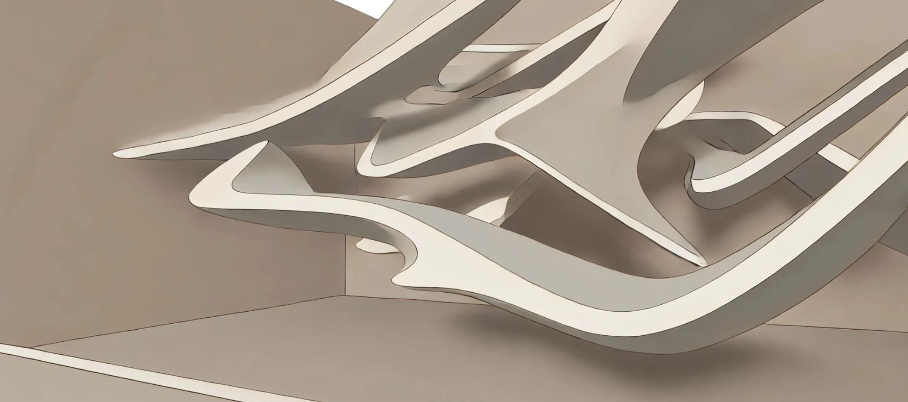

# 19. Modelado de Superficies Complejas

El modelado de superficies complejas es una de las áreas más fascinantes y desafiantes del diseño paramétrico, ya que implica la creación de
formas que trascienden las geometrías simples y regulares para generar estructuras tridimensionales dinámicas, fluidas y adaptables. Para
arquitectos, creativos, técnicos y diseñadores de interiores, el modelado de superficies complejas permite una libertad formal que va más
allá de las limitaciones del diseño tradicional, permitiendo la creación de superficies de doble curvatura, formas orgánicas, estructuras
paramétricas adaptativas y patrones geométricos avanzados.

Estas superficies complejas no solo son visualmente impactantes, sino que también pueden cumplir funciones estructurales, estéticas y
ambientales dentro de un proyecto. Gracias a la flexibilidad y el control proporcionado por las herramientas paramétricas, estas
superficies pueden ser optimizadas para responder a condiciones específicas del entorno, reducir el consumo de materiales o mejorar el
rendimiento energético, sin comprometer la integridad del diseño.

## La base del modelado de superficies complejas: Curvas y geometría paramétrica

El modelado de superficies complejas suele comenzar con la creación de **curvas paramétricas** que sirven como base para la generación de la
superficie. Estas curvas son definidas mediante ecuaciones o algoritmos que permiten su manipulación en función de parámetros específicos, como
el radio, la curvatura, la inclinación o los puntos de control. La flexibilidad de estas curvas es clave, ya que pueden ser ajustadas de
manera dinámica para generar una variedad de formas y geometrías.

Por ejemplo, en una superficie de doble curvatura, las curvas de control se pueden manipular para que cambien su inclinación o radio a lo largo de
diferentes ejes, creando una superficie que fluye de manera continua y orgánica. Este tipo de superficies es común en la arquitectura
contemporánea, donde se buscan formas que imiten las curvas de la naturaleza o que generen una estética fluida y dinámica. Estas
superficies también se utilizan en el diseño de interiores para crear techos ondulantes, mobiliario ergonómico o elementos decorativos con
formas biomórficas.

La manipulación paramétrica de las curvas permite que las superficies resultantes se ajusten automáticamente en función de los cambios en los
parámetros. Por ejemplo, una curva que define el perfil de una fachada puede ser ajustada para responder a diferentes condiciones climáticas o a
la orientación del edificio, generando una superficie que optimiza la entrada de luz natural o la ventilación cruzada.

## Superficies NURBS: Precisión y flexibilidad

Uno de los métodos más utilizados en el modelado de superficies complejas es el uso de **NURBS** (Non-Uniform Rational B-Splines). Las
superficies NURBS son extremadamente flexibles y precisas, lo que las hace ideales para crear geometrías complejas con un control detallado
sobre las curvas y la forma general de la superficie. A diferencia de las geometrías poligonales, que están limitadas por la resolución de los
polígonos, las superficies NURBS permiten representar curvas suaves y continuas sin perder precisión, lo que las hace especialmente útiles en
proyectos donde se requiere una alta fidelidad geométrica.

En el diseño paramétrico, las superficies NURBS pueden ser generadas a partir de curvas de control que definen la forma de la superficie. Estas
curvas pueden ser ajustadas mediante parámetros que controlan la posición, el radio y la curvatura, lo que permite generar una amplia gama
de formas. Una de las características más potentes de las superficies NURBS es su capacidad para manipular tanto la forma global de la
superficie como los detalles locales, lo que permite un control preciso sobre la geometría final.

Por ejemplo, al diseñar un mobiliario paramétrico, se puede utilizar una superficie NURBS para definir la forma del asiento. Los puntos de control
de la curva NURBS pueden ser ajustados para generar una superficie que se adapte ergonómicamente a la forma del cuerpo humano, creando una pieza
de mobiliario cómoda y funcional. Al mismo tiempo, la superficie puede ser optimizada para minimizar el uso de material o mejorar la estabilidad
estructural, ajustando automáticamente la forma en función de las condiciones definidas en el algoritmo.

## Técnicas avanzadas de modelado: Lofting, barrido y revoluciones

Para generar superficies complejas en el diseño paramétrico, se pueden utilizar varias técnicas avanzadas de modelado que permiten transformar
curvas y perfiles 2D en superficies tridimensionales. Entre estas técnicas destacan el **lofting**, el **barrido** y las **revoluciones**.

1. **Lofting**: El lofting es una técnica que permite generar una superficie conectando varias curvas o perfiles en diferentes planos. Esta técnica es ideal para crear superficies orgánicas o fluidas que varían de forma a lo largo de su longitud. En el contexto paramétrico, el lofting permite que las curvas de control sean ajustadas de manera dinámica, lo que genera superficies que pueden adaptarse a diferentes condiciones o requerimientos. Un ejemplo común es la creación de techos ondulantes o fachadas curvas, donde el lofting permite una transición suave entre diferentes perfiles, generando una superficie continua y fluida.

2. **Barrido (Sweep)**: El barrido es otra técnica que se utiliza para generar superficies complejas a partir de una curva o perfil 2D. En el barrido, un perfil es "barrido" a lo largo de una trayectoria definida por otra curva, generando una superficie tridimensional que sigue esa trayectoria. Esta técnica es extremadamente útil cuando se necesita generar formas que sigan una trayectoria específica, como una barandilla o una fachada ondulante. El barrido paramétrico permite ajustar tanto el perfil como la trayectoria, lo que genera una gran flexibilidad en la creación de formas complejas.

3. **Revoluciones**: La técnica de revoluciones implica rotar un perfil 2D alrededor de un eje para generar una superficie tridimensional. Este método es ideal para crear superficies simétricas y curvas, como esferas, cilindros o conos. En el contexto del diseño paramétrico, la técnica de revoluciones permite ajustar tanto el perfil que se rota como el ángulo de rotación, generando una amplia variedad de formas y volúmenes. Las revoluciones son particularmente útiles en proyectos que requieren geometrías circulares o radiales, como columnas, lámparas o techos abovedados.

## Optimización de superficies complejas: Eficiencia estructural y material

Una de las principales ventajas del diseño paramétrico es la capacidad de **optimizar** las superficies complejas para mejorar su rendimiento
estructural y reducir el consumo de materiales. Mediante la integración de datos estructurales y simulaciones físicas, los diseñadores pueden
ajustar los parámetros de una superficie para asegurar que sea estructuralmente estable, eficiente en el uso de materiales y funcional
en su aplicación.

Por ejemplo, en una estructura de fachada paramétrica, las superficies pueden ser optimizadas para soportar las cargas de viento o para
maximizar la eficiencia energética al regular la entrada de luz natural. Los algoritmos de optimización pueden ajustar la curvatura de la
superficie para distribuir las cargas de manera uniforme, reduciendo la necesidad de refuerzos estructurales adicionales y minimizando el uso de
materiales costosos. Esto no solo mejora la viabilidad del proyecto, sino que también contribuye a su sostenibilidad.

En el diseño de interiores, la optimización de superficies complejas puede aplicarse a elementos como techos o paredes acústicas. Mediante el
uso de simulaciones acústicas, los diseñadores pueden ajustar los parámetros de una superficie para mejorar la absorción del sonido o
reducir la reverberación en un espacio. Las superficies ondulantes o con patrones geométricos complejos pueden ser diseñadas para dispersar el
sonido de manera uniforme, mejorando la calidad acústica sin comprometer la estética del diseño.

## Superficies adaptativas: Respuesta a condiciones ambientales

Una de las aplicaciones más innovadoras del modelado de superficies complejas en el diseño paramétrico es la creación de
**superficies adaptativas**, que pueden ajustar su forma en función de las condiciones ambientales o del comportamiento de los usuarios. Estas
superficies son controladas por algoritmos que utilizan datos en tiempo real para modificar la geometría de la superficie en función de
parámetros externos, como la luz solar, la temperatura o el flujo de personas.

Un ejemplo típico es la creación de fachadas adaptativas que pueden ajustar sus elementos de sombreado en función de la cantidad de luz solar
que incide sobre el edificio. En un clima cálido, la superficie puede ajustarse para proporcionar más sombra durante las horas de mayor
radiación solar, mientras que en un clima frío, puede abrirse para maximizar la entrada de luz natural y reducir la necesidad de
calefacción. Este tipo de superficie adaptativa no solo mejora la eficiencia energética del edificio, sino que también crea un lenguaje
visual dinámico y en constante cambio.

En el diseño de interiores, las superficies adaptativas pueden utilizarse para crear techos o paredes que respondan a las necesidades de
los usuarios. Por ejemplo, en un espacio de trabajo, un techo parametrizado podría ajustar su altura o curvatura en función del nivel
de ruido en la sala, mejorando la acústica y el confort de los empleados. Del mismo modo, las superficies pueden ser diseñadas para
ajustar su forma o patrón en función de la actividad que se esté llevando a cabo en el espacio, proporcionando una experiencia
personalizada y adaptativa.