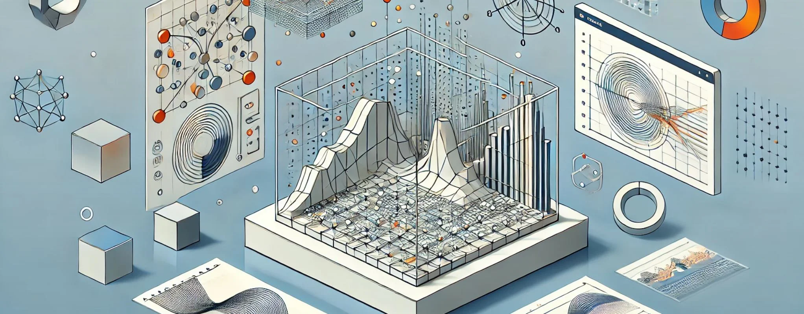

# 20. Simulaciones y Análisis Paramétrico

Las **simulaciones y el análisis paramétrico** son componentes esenciales del diseño paramétrico, ya que permiten a arquitectos,
creativos, técnicos y diseñadores de interiores evaluar y optimizar sus proyectos en función de múltiples criterios, como la estabilidad
estructural, el rendimiento energético, el comportamiento ambiental, y otros factores clave. Al integrar simulaciones en el proceso de diseño,
los profesionales no solo pueden visualizar cómo se comportarán sus diseños en condiciones reales, sino que también pueden ajustar los
parámetros de manera dinámica para mejorar la eficiencia, reducir los costos y minimizar el impacto ambiental.

En el diseño paramétrico, las simulaciones no son simples representaciones estáticas del modelo, sino que forman parte de un
**ciclo iterativo** en el que los datos de las simulaciones se utilizan para ajustar y optimizar el diseño en tiempo real. Las herramientas
avanzadas permiten realizar simulaciones de comportamiento estructural, análisis ambiental, simulaciones de iluminación natural, comportamiento
acústico y otros estudios que ayudan a tomar decisiones informadas durante el proceso de diseño. Este enfoque basado en simulaciones también
facilita la creación de diseños más sostenibles y adaptativos, que responden a su entorno y a las necesidades de los usuarios.

## Simulaciones estructurales: Estabilidad y rendimiento

Las **simulaciones estructurales** son una parte crucial del análisis paramétrico, ya que permiten evaluar la estabilidad y resistencia de las
formas y estructuras antes de que se construyan. En proyectos arquitectónicos y de diseño de interiores que incluyen geometrías
complejas o estructuras no convencionales, las simulaciones estructurales garantizan que el diseño sea seguro y eficiente en términos
de uso de materiales y distribución de cargas.

El análisis estructural paramétrico se basa en la integración de datos como las **cargas estáticas** y **dinámicas**, la gravedad, el viento,
los terremotos, entre otros factores, en el modelo paramétrico. Los parámetros que definen la forma, el tamaño y la disposición de los
elementos estructurales se pueden ajustar automáticamente en función de los resultados de la simulación, optimizando así la eficiencia del diseño.

Por ejemplo, al diseñar una cubierta ondulante parametrizada, las simulaciones estructurales pueden identificar áreas donde la estructura
esté sometida a tensiones o cargas adicionales. Los algoritmos paramétricos permiten ajustar el grosor de la estructura o la densidad de
los elementos de soporte en estas áreas críticas, asegurando que el diseño sea estable sin añadir peso o costo innecesario. Este proceso
también optimiza el uso de materiales, lo que es clave para mantener el proyecto dentro del presupuesto y hacerlo más sostenible.

Herramientas como **Kangaroo** (en Grasshopper) permiten realizar simulaciones estructurales en tiempo real, lo que facilita la interacción
dinámica entre el diseñador y el modelo. Esta capacidad para ver cómo las fuerzas actúan sobre la estructura a medida que se ajustan los
parámetros permite una mayor exploración formal sin comprometer la estabilidad.

## Simulaciones ambientales: Optimización de rendimiento energético

Uno de los aspectos más relevantes en el diseño paramétrico contemporáneo es la integración de **simulaciones ambientales**, que
permiten evaluar cómo interactúa el diseño con su entorno natural y optimizar su rendimiento energético. Las simulaciones de comportamiento
ambiental incluyen análisis de **iluminación natural**, **sombra**, **ventilación cruzada**, **eficiencia térmica** y otros factores que
afectan la sostenibilidad y el confort de los edificios.

Las herramientas paramétricas permiten simular el comportamiento ambiental en función de datos locales, como la orientación del edificio,
el clima, la ubicación geográfica, y las condiciones atmosféricas. Al realizar estas simulaciones, los diseñadores pueden ajustar los
parámetros del modelo, como la disposición de las ventanas, el tamaño de las aberturas o la inclinación de los techos, para maximizar la entrada
de luz natural o mejorar la ventilación.

Un ejemplo típico de este enfoque es la optimización de una fachada paramétrica para mejorar su comportamiento energético. Al integrar datos
sobre la radiación solar, los diseñadores pueden ajustar los elementos de sombreado en función de la orientación del edificio, lo que permite
reducir la ganancia de calor en verano y maximizar la entrada de luz natural en invierno. Las herramientas como **Ladybug** y **Honeybee** (en
Grasshopper) facilitan este tipo de análisis ambiental, proporcionando una retroalimentación en tiempo real que permite optimizar el diseño
desde las primeras fases del proyecto.

Además, las simulaciones paramétricas también pueden optimizar el uso de **materiales sostenibles** en un proyecto. Al ajustar los parámetros de
los materiales, como el grosor o las propiedades térmicas, los diseñadores pueden simular cómo diferentes opciones afectan el
rendimiento energético del edificio y seleccionar la opción más eficiente en términos de ahorro energético y reducción de la huella de
carbono.

## Simulaciones de iluminación natural y artificial

La **iluminación** es un factor clave en el diseño arquitectónico y de interiores, y las simulaciones paramétricas permiten evaluar cómo se
comportará la luz natural y artificial dentro de un espacio. Estas simulaciones ayudan a los diseñadores a tomar decisiones informadas sobre
la orientación del edificio, la disposición de las ventanas y la ubicación de las fuentes de luz artificial.

En el caso de la **iluminación natural**, los algoritmos paramétricos pueden ajustar automáticamente las aberturas y los elementos de sombreado
para maximizar la entrada de luz solar en las áreas deseadas y evitar el deslumbramiento o el sobrecalentamiento. Por ejemplo, en un espacio
comercial parametrizado, se pueden realizar simulaciones de luz diurna para determinar el mejor diseño de las claraboyas y ventanas, asegurando
que las áreas de exhibición de productos estén bien iluminadas de forma natural durante el día.

Las herramientas de simulación, como **DIVA** (en Grasshopper), permiten analizar el comportamiento de la luz en función de la hora del día y la
época del año, lo que facilita la creación de diseños adaptativos que maximizan el uso de la luz natural. Esto no solo mejora la experiencia
del usuario, sino que también reduce la dependencia de la iluminación artificial, lo que resulta en un menor consumo de energía.

En cuanto a la **iluminación artificial**, las simulaciones paramétricas permiten optimizar la ubicación y distribución de las fuentes de luz en
función de la actividad y el uso del espacio. Por ejemplo, en el diseño de una sala de conferencias, las simulaciones pueden ajustar los
parámetros de las luminarias para garantizar que la luz se distribuya uniformemente y no cause sombras o deslumbramiento. Estos algoritmos
también pueden optimizar el consumo energético de los sistemas de iluminación, ajustando la intensidad o la dirección de la luz en función
de la ocupación o el nivel de luz natural.

## Simulaciones acústicas: Diseño para el confort sonoro

En el diseño de interiores, especialmente en espacios como auditorios, teatros, oficinas o restaurantes, el **comportamiento acústico** es
fundamental para garantizar una buena calidad sonora. Las simulaciones paramétricas permiten evaluar cómo se comportará el sonido en un espacio
y ajustar los elementos del diseño para optimizar la acústica.

Mediante la simulación de **reverberación**, **absorción** y **dispersión del sonido**, los diseñadores pueden ajustar las
superficies, materiales y formas del espacio para mejorar la calidad acústica. Por ejemplo, en un auditorio parametrizado, los algoritmos
pueden ajustar la curvatura de las paredes y techos para reflejar el sonido de manera uniforme, evitando puntos muertos o ecos no deseados.
Del mismo modo, los paneles acústicos pueden ser diseñados paramétricamente para ajustarse automáticamente a las condiciones sonoras
del espacio.

En un entorno de trabajo, como una oficina abierta, las simulaciones acústicas pueden optimizar la disposición del mobiliario o los elementos
divisorios para reducir el ruido ambiental y mejorar el confort de los empleados. Las simulaciones paramétricas permiten ajustar la densidad, el
grosor y la disposición de los elementos acústicos en función de la cantidad de personas en el espacio o el nivel de ruido esperado, creando
un entorno de trabajo más cómodo y eficiente.

## Simulaciones de comportamiento de usuarios: Optimización de espacios

Otra aplicación importante de las simulaciones paramétricas es el análisis del **comportamiento de los usuarios** dentro de un espacio. Al
integrar datos sobre cómo las personas interactúan con el diseño, los algoritmos pueden ajustar automáticamente la disposición de los elementos
para optimizar la funcionalidad y el confort del espacio.

En un espacio comercial, por ejemplo, las simulaciones pueden analizar el flujo de clientes y ajustar la disposición de los productos para
mejorar la visibilidad y aumentar las ventas. Del mismo modo, en un edificio de oficinas, los algoritmos pueden ajustar la distribución del
mobiliario en función del comportamiento de los empleados, optimizando el uso del espacio y mejorando la eficiencia.

Las simulaciones paramétricas también permiten optimizar los **sistemas de circulación** dentro de un edificio. Mediante el análisis del flujo de
personas, los algoritmos pueden ajustar la disposición de los pasillos, escaleras o entradas para evitar cuellos de botella y mejorar la
accesibilidad. Este enfoque es particularmente útil en grandes instalaciones, como hospitales, aeropuertos o centros comerciales, donde
la gestión eficiente del flujo de personas es fundamental para el buen funcionamiento del edificio.

## Simulaciones en tiempo real: Respuesta adaptativa

Una de las características más innovadoras del diseño paramétrico es la capacidad de realizar **simulaciones en tiempo real**, lo que permite que
los diseños se adapten automáticamente a las condiciones cambiantes. Mediante la integración de **sensores** que recopilan datos en tiempo
real, los modelos paramétricos pueden ajustar su geometría o comportamiento en función de variables como la temperatura, la ocupación
o la luz solar.