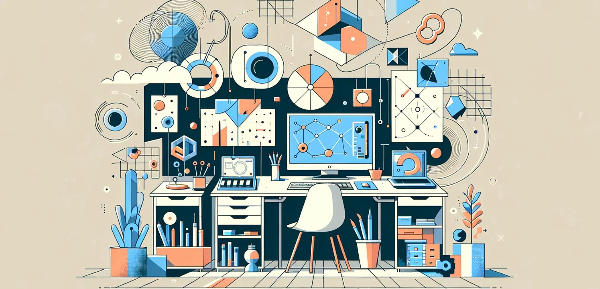

# 21. Taller de Creatividad: Experimentación Libre

El concepto de un "Taller de Creatividad" en el diseño paramétrico invita a la **experimentación libre**, un enfoque en el que los
arquitectos, creativos, técnicos y diseñadores de interiores exploran sin restricciones las posibilidades que ofrecen las herramientas
digitales para generar formas, estructuras y espacios únicos. Este taller es un espacio mental y práctico donde las reglas pueden
reinterpretarse y los límites del diseño convencional son desafiados, permitiendo que surjan innovaciones inesperadas y soluciones creativas
que se alimentan de la interacción dinámica entre parámetros, algoritmos y datos.

El propósito de este tipo de taller es fomentar un ambiente de juego, en el que el diseñador puede **experimentar** con diversas técnicas,
algoritmos y geometrías, con la libertad de cometer errores y aprender a partir de ellos. La experimentación libre permite crear geometrías
inesperadas, patrones complejos y sistemas adaptativos que, de otro modo, no serían posibles utilizando enfoques tradicionales. Aquí, la
creatividad no solo se entiende como un acto de ideación espontánea, sino como un proceso guiado por la interacción entre las herramientas
paramétricas, los datos y las posibilidades algorítmicas.

## El poder de la iteración: Explorar sin restricciones

En un taller de creatividad paramétrica, uno de los principios clave es la **iteración constante**. Gracias a la naturaleza paramétrica del
proceso de diseño, los modelos pueden modificarse y transformarse de manera continua simplemente ajustando los parámetros definidos. Este
enfoque iterativo permite a los diseñadores explorar múltiples variaciones formales y funcionales de un mismo concepto sin necesidad de
comenzar de nuevo.

Por ejemplo, un diseñador que trabaja en la creación de un mueble parametrizado podría definir un conjunto de parámetros para controlar
aspectos como la altura, el ancho, el grosor del material, la curvatura de las superficies, o incluso la textura. En lugar de comprometerse con
una única versión del mueble, puede experimentar libremente cambiando los valores de los parámetros y generando nuevas versiones. Esta
iteración no solo abre la puerta a soluciones más creativas y refinadas, sino que también permite al diseñador encontrar la configuración óptima
en términos de funcionalidad, estética y uso de materiales.

Un ejercicio típico en este contexto podría implicar tomar una geometría básica, como un cubo o una esfera, y aplicar algoritmos paramétricos para
deformar, subdividir o transformar la forma de manera inusual. Las herramientas paramétricas permiten realizar transformaciones complejas,
como torsión, curvatura progresiva o generación de patrones geométricos intrincados sobre la superficie de la forma original. El objetivo es
explorar cómo los parámetros pueden ser utilizados para desafiar las expectativas y descubrir nuevas posibilidades formales.

## Algoritmos generativos: Creatividad guiada por reglas

En el corazón de la experimentación creativa paramétrica están los **algoritmos generativos**, que permiten a los diseñadores definir reglas
para generar geometrías, patrones y comportamientos a partir de un conjunto inicial de condiciones. En lugar de diseñar cada detalle
manualmente, el diseñador establece las reglas básicas y luego permite que el algoritmo explore un rango de soluciones. Este enfoque abre un
vasto espectro de posibilidades que se basan en la interacción entre los parámetros y el algoritmo.

Un ejemplo de esto es el uso de algoritmos basados en **patrones geométricos**, como los **diagramas de Voronoi** o las **tesselaciones**.
Un diseñador podría experimentar con la subdivisión de una superficie en células de Voronoi y luego ajustar los parámetros que controlan la
disposición, tamaño o densidad de las células. El resultado puede ser una superficie compleja con patrones orgánicos que varían en función de
los parámetros, generando texturas únicas y estructuralmente interesantes.

Otro enfoque es la creación de patrones modulares o **estructuras autoorganizadas**, donde los elementos de un diseño (por ejemplo, una
fachada o un sistema de mobiliario) están interrelacionados mediante algoritmos que responden a condiciones específicas. Un taller de
creatividad puede explorar cómo estas estructuras modulares pueden transformarse en función de diferentes entradas, como la posición del
sol, la dirección del viento o el flujo de personas. Los diseñadores pueden jugar con diferentes combinaciones de parámetros para crear
patrones y estructuras que se adaptan al contexto y al entorno de manera dinámica.

## Manipulación de superficies: Desde lo básico hasta lo avanzado

La **manipulación de superficies** es un área clave para la experimentación en el diseño paramétrico. Las superficies complejas, que
pueden comenzar como formas simples (un plano, una curva o una superficie básica), son transformadas mediante algoritmos para generar
ondulaciones, patrones geométricos o formas tridimensionales sofisticadas. Un taller de creatividad puede abordar diferentes técnicas
de manipulación de superficies, como el **barrido**, el **lofting** o el **plegado**, permitiendo a los diseñadores explorar cómo las superficies
pueden comportarse de manera no lineal.

Un ejemplo de esto sería la creación de un techo parametrizado en el que los paneles se pliegan y despliegan en función de la entrada de luz
natural. En lugar de diseñar una superficie estática, los algoritmos paramétricos permiten ajustar la superficie para que responda a
diferentes condiciones lumínicas, creando una estructura en constante cambio. La manipulación de la geometría puede incluir torsión,
subdivisión o la aplicación de patrones repetitivos que varían a lo largo de la superficie.

Otra posibilidad es explorar superficies generadas por fuerzas físicas, como la gravedad o la tensión. Utilizando herramientas como **Kangaroo**
(un motor de simulación física en Grasshopper), los diseñadores pueden aplicar fuerzas sobre una superficie y observar cómo se deforma de manera
natural. Esta simulación permite crear formas que imitan comportamientos físicos, como la tensión de una tela o la distribución del peso en una
estructura, generando superficies complejas y visualmente atractivas.

## Exploración de materiales: Innovación en la experimentación

El **taller de creatividad** también invita a explorar cómo los parámetros pueden influir en la **elección y comportamiento de los materiales**.
A menudo, los diseñadores limitan su creatividad a la manipulación de la forma, pero en un enfoque paramétrico, los materiales pueden
parametrizarse para cambiar sus propiedades o su disposición en función de las necesidades del diseño.

Por ejemplo, un diseñador podría experimentar con **un material que varíe su densidad o espesor** en función de los requisitos estructurales.
Al integrar datos estructurales o ambientales en el modelo paramétrico, el material puede ajustarse dinámicamente para proporcionar mayor soporte
donde sea necesario o para reducir el uso de material en áreas donde no se requiera tanto. Este enfoque puede generar estructuras livianas y
eficientes que utilizan menos recursos sin comprometer la estabilidad.

Otro campo de experimentación es el **uso de materiales avanzados o sostenibles** en combinación con algoritmos paramétricos. Materiales como
**bioplásticos**, **maderas recicladas** o **composites de fibra de carbono** pueden parametrizarse para ajustarse a la geometría del diseño
y adaptarse a las restricciones del proyecto. Por ejemplo, en un proyecto de mobiliario paramétrico, el diseñador podría experimentar con
cómo el material cambia de forma o se adapta a diferentes condiciones de uso, generando muebles que sean no solo funcionales, sino también
sostenibles y adaptativos.

## Exploración artística: Diseño y arte digital

La experimentación creativa en el diseño paramétrico también permite que los diseñadores exploren el **arte digital** como una forma de expresarse
mediante algoritmos y geometrías generativas. A menudo, el diseño paramétrico es percibido únicamente desde una perspectiva técnica, pero
su capacidad para generar geometrías complejas lo convierte en una poderosa herramienta para la creación artística.

En un taller de creatividad, los diseñadores pueden utilizar las herramientas paramétricas para crear **instalaciones artísticas**,
esculturas generativas o incluso **intervenciones en espacios públicos** que exploren la relación entre el arte y la tecnología. Al utilizar
algoritmos que responden a datos del entorno o al comportamiento del espectador, las piezas de arte digital pueden transformarse en tiempo
real, creando una experiencia interactiva e inmersiva.

Por ejemplo, un diseñador podría crear una escultura parametrizada que responda a las condiciones del viento, moviéndose y cambiando de forma en
función de la intensidad y dirección del viento. Este tipo de instalaciones no solo exploran la estética y la forma, sino también el
comportamiento y la interacción, generando una pieza de arte que evoluciona en respuesta a su entorno.

## Libertad creativa con restricciones paramétricas

Aunque el taller de creatividad fomenta la experimentación sin restricciones, es importante destacar que las **restricciones paramétricas**
pueden ser una fuente poderosa de inspiración. Al establecer reglas claras sobre cómo deben interactuar los parámetros, los diseñadores
pueden descubrir nuevas soluciones que no habrían sido posibles sin esas limitaciones.

Por ejemplo, un diseñador que experimenta con la generación de patrones modulares puede establecer una restricción que limite el tamaño de los
módulos o la cantidad de material utilizado. Estas restricciones pueden parecer limitantes al principio, pero a menudo conducen a soluciones más
ingeniosas y creativas, ya que el diseñador debe encontrar formas de cumplir con los requisitos establecidos sin comprometer la calidad
estética o funcional del diseño.