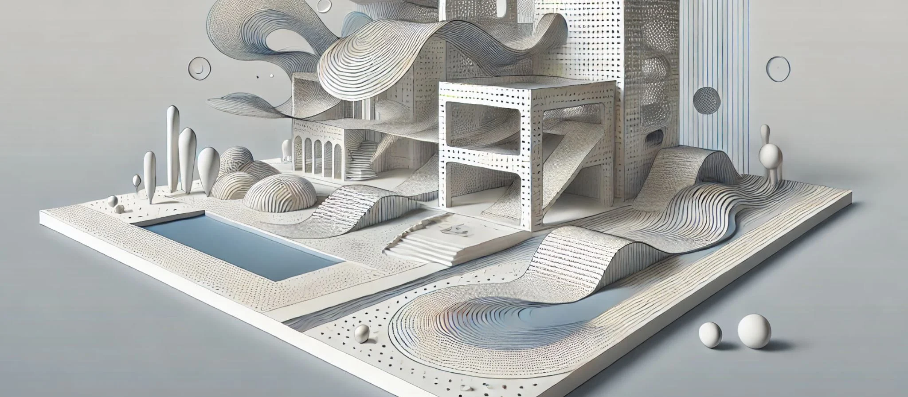

## 22. Diseño Arquitectónico Paramétrico: Creando Estructuras Innovadoras

El diseño arquitectónico paramétrico ha emergido como una de las metodologías más innovadoras en el campo de la arquitectura, redefiniendo la manera en que los arquitectos conciben, planifican y construyen edificios y estructuras. A través de la implementación de parámetros controlables y la utilización de algoritmos avanzados, el diseño paramétrico permite a los arquitectos no solo generar formas y geometrías complejas, sino también optimizar esas estructuras para responder de manera eficiente a una amplia gama de criterios funcionales, estéticos y ambientales.

El poder del diseño paramétrico radica en su capacidad para automatizar el proceso de creación y permitir la iteración rápida, lo que facilita la exploración de múltiples soluciones formales sin necesidad de redibujar o replantear el proyecto desde cero. Los arquitectos ya no están limitados por las herramientas convencionales o los enfoques tradicionales de diseño; en cambio, utilizan datos, simulaciones y reglas paramétricas para dar forma a sus proyectos, lo que resulta en estructuras que son altamente adaptables, innovadoras y, a menudo, completamente personalizadas para sus entornos y usuarios.

## La base del diseño paramétrico: Parámetros y algoritmos

El diseño paramétrico se basa en la idea de que los arquitectos no diseñan directamente el edificio final, sino que definen las **reglas** y
**relaciones** que determinan cómo se genera ese edificio. Estas reglas están gobernadas por **parámetros**: variables que pueden ajustarse para
influir en la geometría, el comportamiento y la función de la estructura. Los parámetros pueden controlar aspectos como la altura, el
ancho, la curvatura, la disposición de los espacios, la orientación o el tamaño de las aperturas, entre muchos otros.

Por ejemplo, un arquitecto puede establecer un parámetro para controlar la disposición de los paneles de una fachada en función de la incidencia
de la luz solar. A medida que la orientación del edificio cambia, el algoritmo ajusta automáticamente la disposición y el tamaño de los
paneles para optimizar la eficiencia energética, reduciendo la ganancia de calor en verano y maximizando la entrada de luz natural en invierno.
Esta **flexibilidad paramétrica** permite que el diseño evolucione y se ajuste en tiempo real en función de las condiciones del entorno o de los
requisitos del cliente.

Los **algoritmos** son el corazón del diseño paramétrico, ya que permiten definir la lógica que gobierna cómo los parámetros interactúan
entre sí. Los algoritmos generativos, por ejemplo, pueden utilizarse para crear formas geométricas complejas o patrones de comportamiento
estructural basados en principios matemáticos. Un ejemplo clásico es el uso de **diagramas de Voronoi** o **estructuras fractales** para generar
patrones en una fachada o estructura. Estos patrones no solo son visualmente impactantes, sino que también pueden optimizar el uso de
materiales o mejorar el rendimiento ambiental del edificio.

## Geometrías complejas: Superficies de doble curvatura y estructuras fluidas

Uno de los principales beneficios del diseño paramétrico es la capacidad de generar **geometrías complejas**, como superficies de doble curvatura
o formas fluidas, que serían difíciles o imposibles de crear mediante técnicas de diseño tradicionales. Estas geometrías permiten a los
arquitectos explorar nuevas formas de expresión y crear edificios que se integran de manera más fluida con su entorno natural o urbano.

Las **superficies de doble curvatura** son especialmente populares en la arquitectura contemporánea, ya que permiten crear envolventes
arquitectónicas que son tanto estructuralmente eficientes como estéticamente atractivas. Estas superficies, que pueden ser generadas y
controladas mediante algoritmos paramétricos, permiten que la estructura se ajuste de manera óptima a las fuerzas externas, como la gravedad o el
viento, distribuyendo las cargas de manera más eficiente que una geometría plana o lineal.

Por ejemplo, un techo ondulante parametrizado puede ser diseñado para soportar las cargas de nieve o viento de manera más efectiva que un techo
convencional. Al manipular los parámetros que controlan la curvatura de la superficie, el arquitecto puede ajustar la geometría para reducir el
uso de material en áreas donde no es necesario, al mismo tiempo que refuerza las zonas críticas. Este enfoque no solo mejora la eficiencia
estructural, sino que también permite la creación de formas arquitectónicas que interactúan con el paisaje circundante de manera
fluida y orgánica.

Las **estructuras fluidas** y biomórficas son otra tendencia clave en el diseño paramétrico. Inspiradas en las formas naturales, estas estructuras
pueden ser generadas mediante algoritmos que simulan comportamientos biológicos o geométricos, como la distribución de ramificaciones en un
árbol o la formación de estructuras celulares. Estas formas no solo son visualmente impactantes, sino que también pueden mejorar la eficiencia
funcional del edificio, ya que suelen estar optimizadas para maximizar la luz natural, mejorar la ventilación o reducir el consumo energético.

## Innovación estructural: Sistemas optimizados y eficiencia de materiales

El diseño paramétrico también permite a los arquitectos innovar en el campo de la **ingeniería estructural**, optimizando las estructuras para
mejorar su eficiencia y reducir el uso de materiales. A través de simulaciones estructurales paramétricas, los arquitectos pueden
identificar las áreas de una estructura que están sometidas a mayores esfuerzos y ajustar los parámetros para optimizar la distribución de las
cargas.

Por ejemplo, mediante la simulación de cargas estructurales en un edificio de gran altura, los algoritmos paramétricos pueden ajustar
automáticamente el grosor de los elementos de soporte en función de la cantidad de peso que deben soportar. Esto permite minimizar el uso de
material en áreas donde no es necesario, reduciendo tanto el peso total de la estructura como los costos de construcción.

Un caso típico de innovación estructural es el uso de **estructuras de celosía** o **patrones de Voronoi** para crear sistemas de soporte
ligeros pero extremadamente resistentes. Estas estructuras, generadas mediante algoritmos basados en principios matemáticos, son capaces de
soportar grandes cargas mientras utilizan una cantidad mínima de material. Esto no solo reduce el costo y el tiempo de construcción, sino
que también permite la creación de formas arquitectónicas más libres y abiertas, que no estarían limitadas por los métodos de construcción
convencionales.

Además de la optimización estructural, los algoritmos paramétricos también pueden ser utilizados para mejorar la **eficiencia energética**
de un edificio. Al integrar simulaciones de comportamiento ambiental, los arquitectos pueden ajustar los parámetros del diseño para mejorar el
rendimiento térmico, la ventilación cruzada o la eficiencia lumínica. Estos ajustes permiten que los edificios sean más sostenibles y reduzcan
su huella de carbono, al tiempo que mejoran la calidad de vida de los ocupantes.

## Fachadas adaptativas: Respuesta dinámica al entorno

Una de las aplicaciones más avanzadas del diseño arquitectónico paramétrico es la creación de **fachadas adaptativas**, que responden de
manera dinámica a las condiciones ambientales cambiantes. Estas fachadas, controladas por algoritmos paramétricos, pueden ajustar su
forma, disposición o comportamiento en función de la luz solar, la temperatura, la velocidad del viento o incluso la ocupación del edificio.

Por ejemplo, una fachada paramétrica puede estar compuesta por paneles que se abren y cierran en función de la cantidad de luz solar que incide
sobre el edificio. Durante las horas de mayor radiación solar, los paneles se cierran para proporcionar sombra y reducir la ganancia de
calor, mientras que durante las horas de menor luz, los paneles se abren para maximizar la entrada de luz natural y reducir la necesidad de
iluminación artificial. Esta capacidad de respuesta dinámica no solo mejora la eficiencia energética del edificio, sino que también crea una
fachada que está en constante cambio, lo que añade un elemento visual dinámico al diseño arquitectónico.

Otro ejemplo de fachadas adaptativas es el uso de **mallas cinéticas** que se ajustan en función de la velocidad del viento o las condiciones
atmosféricas. Estas mallas pueden cambiar de forma para minimizar el impacto del viento sobre la estructura o para mejorar la ventilación
natural del edificio. Este tipo de diseño adaptativo no solo optimiza el rendimiento del edificio, sino que también crea una interacción más
profunda entre la arquitectura y su entorno, generando una arquitectura más viva y conectada con el contexto.

## Diseño sostenible: Optimización de recursos y reducción de impacto

El diseño paramétrico no solo impulsa la innovación formal y estructural, sino que también juega un papel fundamental en la
**sostenibilidad**. Al integrar datos ambientales y simulaciones en el proceso de diseño, los arquitectos pueden optimizar el uso de materiales,
mejorar el rendimiento energético y reducir el impacto ambiental de sus proyectos.

Un ejemplo típico es la **optimización de la orientación** y las **estrategias pasivas** de diseño, que se logran a través de simulaciones
de comportamiento ambiental. Los algoritmos paramétricos permiten ajustar la orientación del edificio para maximizar la captación de luz
solar durante el invierno y minimizar la ganancia de calor en verano, lo que reduce la necesidad de calefacción y refrigeración artificial.

Además, los algoritmos pueden optimizar el uso de **materiales sostenibles** al ajustar los parámetros del diseño en función de las
propiedades térmicas, acústicas o estructurales de los materiales. Esto permite minimizar el uso de materiales no renovables y seleccionar
aquellos que sean reciclables o que tengan una menor huella de carbono. En muchos proyectos, el diseño paramétrico también se utiliza para
reducir el desperdicio de material durante la construcción, mediante la optimización de los cortes o la reducción de sobrantes.