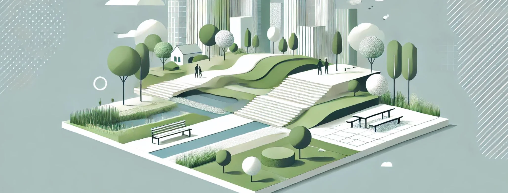

# 24. Diseño Urbano y Paisajismo: Transformando Espacios

El **diseño urbano y paisajismo** paramétrico está transformando la forma en que las ciudades y los espacios públicos son concebidos,
planificados y ejecutados. A través del uso de herramientas paramétricas y la integración de datos contextuales, este enfoque permite a los
diseñadores crear entornos más adaptativos, sostenibles y funcionales, respondiendo de manera dinámica a las necesidades de los habitantes, las
condiciones del sitio y los factores ambientales. Desde parques y plazas hasta redes urbanas y sistemas de transporte, el diseño paramétrico
ofrece una flexibilidad sin precedentes para optimizar espacios en función de criterios variados, como la densidad poblacional, la
circulación de personas, la interacción con el entorno natural, la eficiencia energética y la sostenibilidad.

Este enfoque representa una evolución del diseño tradicional, donde los arquitectos y paisajistas ya no se limitan a crear planos estáticos, sino
que establecen **parámetros ajustables** que permiten la **exploración iterativa** y la **optimización constante** del diseño. Como resultado,
los espacios urbanos y paisajísticos pueden adaptarse a lo largo del tiempo, mejorando su funcionalidad y estética de manera continua a medida
que cambian las condiciones urbanas y sociales.

## Diseño Urbano Paramétrico: Planificación Flexible y Adaptativa

En el contexto del diseño urbano, el enfoque paramétrico permite planificar **estructuras urbanas flexibles** que puedan ajustarse a los
cambios en la densidad poblacional, los patrones de tráfico, las preferencias de los habitantes y las condiciones climáticas. A diferencia
de los métodos tradicionales, donde los diseños de las ciudades son fijos y a menudo requieren grandes esfuerzos para ser modificados, el
diseño paramétrico introduce la posibilidad de ajustar los **parámetros** clave del tejido urbano en tiempo real, generando entornos
más adaptativos y resilientes.

Un ejemplo de esto es la planificación de un **sistema vial** utilizando parámetros que controlen la anchura de las calles, la disposición de las
intersecciones o la colocación de las áreas peatonales. Mediante la integración de datos de tráfico, los diseñadores pueden ajustar estos
parámetros para optimizar el flujo de vehículos y personas, creando un sistema de transporte eficiente que minimice la congestión y mejore la
accesibilidad. Además, estos mismos parámetros pueden ajustarse en función de la evolución de la ciudad, permitiendo adaptar las calles a
nuevos desarrollos o cambios en las necesidades de los usuarios.

Otro ejemplo clave es el diseño de **espacios públicos adaptativos** en áreas urbanas densas. Utilizando herramientas paramétricas, los
diseñadores pueden crear plazas, parques o áreas verdes que se ajusten a la densidad de población o a los flujos de personas a lo largo del día.
Los parámetros que definen el tamaño, la disposición de los espacios o la densidad de vegetación pueden ajustarse dinámicamente en función de
los datos de ocupación o las condiciones climáticas. Esto permite crear espacios públicos que sean atractivos y funcionales en todo momento,
mejorando la calidad de vida de los ciudadanos.

## Datos y Simulaciones: Un Diseño Urbano Basado en Información

Una de las características más poderosas del diseño urbano paramétrico es su capacidad para integrar **datos en tiempo real** y simulaciones que
informan el proceso de diseño. Al incorporar datos sobre el comportamiento de los usuarios, el clima, los patrones de tráfico, o
incluso el nivel de contaminación, los diseñadores pueden ajustar los parámetros del modelo urbano para optimizar la **funcionalidad**,
**sostenibilidad** y **resiliencia** del espacio.

Por ejemplo, al diseñar un nuevo barrio o distrito, los datos sobre **densidad poblacional** pueden integrarse en el modelo paramétrico para
determinar la disposición óptima de los edificios, la infraestructura vial y las áreas verdes. Los parámetros que controlan la altura de los
edificios, la distancia entre ellos o el tamaño de los espacios públicos pueden ajustarse para maximizar la eficiencia del uso del suelo, mejorar
la accesibilidad y minimizar el impacto ambiental.

Otro ejemplo es el uso de simulaciones climáticas en el diseño de **infraestructura verde urbana**. Las herramientas paramétricas permiten
integrar datos sobre la temperatura, la humedad y la radiación solar para optimizar el diseño de parques y plazas. Los parámetros que
controlan la disposición de árboles, estanques o áreas de sombra pueden ajustarse automáticamente para mejorar el confort térmico de los usuarios
y reducir el efecto de **isla de calor** en las ciudades.

Además, el diseño urbano paramétrico puede integrar **datos ambientales** y **simulaciones de sostenibilidad**, como la eficiencia
energética o la gestión de recursos hídricos. Por ejemplo, los parámetros que controlan la disposición de paneles solares en edificios
públicos pueden ajustarse en función de la radiación solar de la zona, optimizando el aprovechamiento de la energía solar. Del mismo modo, la
infraestructura de recolección de agua de lluvia puede ser optimizada mediante algoritmos paramétricos que ajusten la inclinación y el tamaño
de las superficies de recolección en función de las precipitaciones locales.

## Paisajismo Paramétrico: Interacción Dinámica con la Naturaleza

En el **diseño de paisajes**, el enfoque paramétrico permite una interacción más rica y dinámica entre los elementos naturales y los
diseñados. Los **paisajistas paramétricos** trabajan con una combinación de datos ambientales y algoritmos que permiten ajustar el diseño en
función de las características específicas del sitio, como la topografía, la vegetación nativa, el flujo de agua o las condiciones del
suelo. Esto resulta en paisajes que no solo son visualmente atractivos, sino que también son sostenibles y adaptados a las condiciones naturales.

Un ejemplo de paisajismo paramétrico es el **diseño de parques urbanos** en los que los parámetros que controlan la disposición de senderos, áreas
de juego o zonas de descanso se ajustan en función de la topografía del terreno y las condiciones de drenaje. Los algoritmos paramétricos
permiten crear rutas peatonales que se adaptan a las pendientes naturales del sitio, mejorando la accesibilidad sin requerir movimientos
de tierra innecesarios. Además, la vegetación puede ser seleccionada y distribuida de manera paramétrica, maximizando la biodiversidad y
mejorando la sostenibilidad del ecosistema urbano.

El paisajismo paramétrico también puede integrarse en proyectos más ambiciosos de **infraestructura verde**, como la creación de corredores
biológicos dentro de las ciudades o la restauración de áreas degradadas. Al utilizar datos sobre la fauna local, las corrientes de agua o la
erosión del suelo, los diseñadores pueden ajustar los parámetros del proyecto para garantizar que el paisaje no solo sea funcional desde un
punto de vista recreativo, sino que también promueva la **conservación** y **regeneración** del ecosistema.

## Superficies y Patrones Paramétricos: Innovación Estética y Funcional

El uso de **superficies** y **patrones paramétricos** es una de las características más llamativas del diseño urbano y paisajismo
contemporáneo. Los diseñadores pueden utilizar algoritmos para generar patrones geométricos o formas complejas que se ajustan de manera precisa
a las condiciones del sitio o a las necesidades del espacio. Estos patrones no solo son estéticamente atractivos, sino que también pueden
cumplir funciones importantes, como mejorar la accesibilidad, controlar el flujo de personas o maximizar la captación de agua de lluvia.

Por ejemplo, un diseñador puede utilizar patrones paramétricos para crear una plaza pública en la que los pavimentos sigan una geometría
específica que dirija el flujo de personas hacia las áreas más importantes, como los puntos de reunión o los accesos principales. Los
patrones en el suelo también pueden integrarse con el **drenaje urbano**, permitiendo que el agua de lluvia se canalice de manera
eficiente hacia áreas de almacenamiento o riego.

Otra aplicación interesante es la creación de **superficies verdes paramétricas**, donde los parámetros que controlan la disposición de la
vegetación se ajustan en función de las condiciones ambientales y las necesidades del proyecto. Los patrones de plantación pueden optimizarse
para maximizar la absorción de CO2, reducir el consumo de agua o mejorar la biodiversidad en áreas urbanas. Este enfoque también permite crear
paisajes más dinámicos y variados, donde las especies de plantas pueden ajustarse a lo largo del tiempo en respuesta a cambios en el clima o en
el uso del espacio.

## Optimización de Espacios Públicos: Diseño Adaptativo y Sostenible

La optimización de **espacios públicos** es uno de los mayores beneficios del diseño paramétrico en el urbanismo y el paisajismo. A
través de la manipulación de parámetros, los diseñadores pueden crear espacios que respondan a las **necesidades de la comunidad** y a las
**condiciones ambientales**, generando entornos más inclusivos, atractivos y sostenibles.

Por ejemplo, al diseñar una plaza o parque urbano, los parámetros que controlan el tamaño de las áreas verdes, la disposición de los bancos o
la ubicación de las áreas de sombra pueden ajustarse para maximizar el confort de los usuarios en diferentes momentos del día. Los diseñadores
pueden integrar datos sobre el comportamiento de los usuarios y las condiciones climáticas para ajustar el diseño de manera dinámica,
asegurando que el espacio sea funcional y acogedor en todo momento.