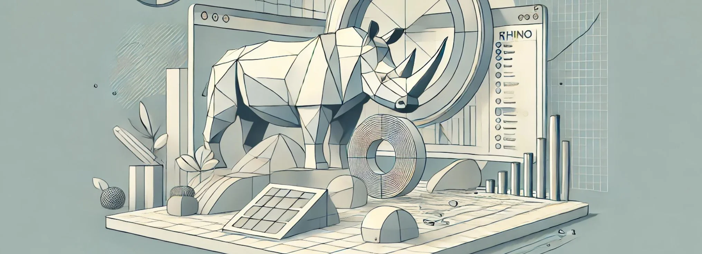

## 27. Dominando Rhino: Herramienta Clave en Diseño Paramétrico

**Rhino** (Rhinoceros) se ha convertido en una de las herramientas más importantes para arquitectos, diseñadores y creativos que buscan dominar
el **diseño paramétrico**. Su capacidad para manejar geometrías complejas, superficies de alta precisión y su integración con
**Grasshopper** lo convierten en una plataforma poderosa para la creación de formas innovadoras y la resolución de problemas complejos de
diseño. Rhino permite a los usuarios trabajar con una amplia gama de herramientas de modelado 3D, que pueden ser utilizadas para generar
estructuras tanto geométricamente avanzadas como funcionalmente optimizadas, desde proyectos arquitectónicos y urbanos, hasta diseño de
producto y mobiliario.

**Grasshopper**, un plugin visual para Rhino, es lo que potencia el diseño paramétrico dentro de esta plataforma. Grasshopper permite a los
diseñadores trabajar con **algoritmos visuales**, lo que facilita la creación de relaciones entre diferentes parámetros de diseño. A través de
la manipulación de esos parámetros, los usuarios pueden generar formas complejas que responden a diferentes requisitos funcionales,
estructurales y estéticos, sin la necesidad de programar en un lenguaje de código tradicional.

En este artículo, exploraremos las claves para dominar Rhino en el contexto del **diseño paramétrico**, desde su interfaz y funciones
básicas, hasta el uso de Grasshopper y otras herramientas avanzadas que permiten llevar el diseño a otro nivel.

## 1. Interfaz de Rhino: Conociendo el entorno de trabajo

Al comenzar con Rhino, lo primero que debes dominar es su **interfaz**. Rhino ofrece un espacio de trabajo flexible y optimizado para el modelado
en 3D, lo que te permite ver y manipular tus modelos desde múltiples perspectivas. Rhino cuenta con una serie de **vistas predefinidas** (Top,
Front, Right, Perspective), lo que facilita trabajar desde diferentes ángulos para crear geometrías precisas.

Entre los componentes clave de la interfaz están:

* **Barras de herramientas**: En la parte superior, encontrarás una serie de herramientas para realizar tareas como creación de curvas, superficies, sólidos y la edición de mallas.

* **Comandos**: Rhino es muy conocido por su **línea de comandos**, donde los usuarios pueden escribir directamente comandos para generar geometrías o modificar las existentes. La posibilidad de utilizar comandos facilita la creación de geometrías precisas y la manipulación directa de los elementos.

* **Capas**: Al igual que en programas de diseño 2D, Rhino utiliza capas para organizar diferentes partes del modelo. Esto es fundamental para trabajar con proyectos complejos, ya que permite activar y desactivar diferentes elementos según sea necesario.

* **Ventanas de vista**: Estas ventanas permiten observar el modelo desde diferentes ángulos simultáneamente, lo que facilita trabajar en 3D con precisión. Cada ventana puede configurarse para mostrar diferentes tipos de vistas, como alámbricas, sombreadas o de representación rápida.

Dominar la interfaz de Rhino es esencial para aprovechar al máximo sus capacidades, ya que te permitirá trabajar de manera más eficiente en proyectos complejos.

## 2. Herramientas básicas de modelado en Rhino

Rhino es reconocido por su capacidad para trabajar con **superficies NURBS** (Non-Uniform Rational B-Splines), que permiten la creación de
superficies curvas y geometrías complejas con un alto nivel de precisión. Las NURBS son ideales para modelar desde muebles con formas
fluidas hasta fachadas arquitectónicas onduladas.

Entre las herramientas básicas de Rhino que debes dominar para el diseño paramétrico se encuentran:

* **Curvas**: El punto de partida para muchas geometrías paramétricas es la creación de curvas. Estas pueden ser generadas con herramientas como la curva libre, la curva de control de puntos, curvas interpoladas o incluso a partir de ecuaciones paramétricas. Las curvas son el fundamento sobre el cual se pueden generar superficies complejas mediante operaciones como la extrusión, el barrido (sweep), o el lofting.

* **Superficies**: Las superficies son los elementos que generan el volumen y la complejidad de las formas en Rhino. Puedes generar superficies a partir de curvas utilizando comandos como **Extrude**, **Loft**, **Revolve** o **Sweep**. Cada una de estas técnicas permite crear formas tridimensionales basadas en los contornos de las curvas.

* **Sólidos**: Los sólidos en Rhino permiten la creación de objetos tridimensionales más precisos, como cubos, cilindros, esferas y otras formas regulares. Estos sólidos se pueden modificar utilizando operaciones booleanas (unión, diferencia e intersección), lo que permite esculpir o combinar formas para crear estructuras más complejas.

* **Edición de mallas**: Rhino también incluye herramientas avanzadas para editar mallas, lo que es útil cuando se trabaja con geometrías más orgánicas o se realizan impresiones 3D. La edición de mallas te permite trabajar con geometrías poligonales que complementan el trabajo con superficies NURBS.

## 3. Introducción a Grasshopper: Algoritmos visuales para el diseño paramétrico

**Grasshopper** es una extensión de Rhino que proporciona una interfaz de programación visual. En lugar de escribir código, puedes conectar
componentes que representan operaciones geométricas o matemáticas para crear un **flujo de trabajo paramétrico**. Esto significa que cada
aspecto del diseño puede ser controlado y ajustado en función de diferentes parámetros, permitiendo la exploración de múltiples soluciones
sin necesidad de redibujar o modelar nuevamente.

* **Componentes**: Grasshopper funciona a través de una serie de componentes, que se conectan entre sí para formar una secuencia de operaciones. Los componentes incluyen desde operaciones matemáticas básicas hasta complejas transformaciones geométricas. Los componentes pueden controlarse con deslizadores, lo que permite ajustar los parámetros de manera interactiva y ver cómo cambian las geometrías en tiempo real.

* **Algoritmos visuales**: Grasshopper utiliza un enfoque de programación visual, lo que significa que los usuarios construyen algoritmos conectando "bloques" visuales en lugar de escribir código. Estos algoritmos definen cómo se comportan las formas y permiten la creación de geometrías dinámicas. A medida que ajustas los parámetros, el diseño se actualiza automáticamente, permitiendo una exploración rápida y eficiente.

* **Curvas y superficies paramétricas**: Una de las principales ventajas de Grasshopper es su capacidad para generar curvas y superficies complejas que responden a las condiciones de entrada. Por ejemplo, puedes generar una estructura de fachada basada en datos solares o crear mobiliario adaptativo que cambie de forma según las necesidades del usuario. Estos procesos son posibles gracias a los algoritmos visuales, que definen cómo se comportan las formas en función de los parámetros de entrada.

## 4. Aplicaciones avanzadas de Grasshopper: Plugins y extensiones

Una de las grandes fortalezas de Rhino y Grasshopper es la amplia gama de **plugins y extensiones** que puedes integrar para ampliar las
capacidades del diseño paramétrico. Algunos de los plugins más útiles incluyen:

* **Kangaroo**: Kangaroo es un motor de simulación física que permite modelar geometrías basadas en principios físicos, como la tensión, la gravedad y las fuerzas de presión. Este plugin es ideal para diseñar estructuras que responden a las leyes de la física de manera natural, como las membranas tensadas, las estructuras de cable y las formas inflables.

* **Ladybug y Honeybee**: Estos plugins permiten realizar simulaciones de comportamiento ambiental en Grasshopper, lo que facilita la optimización de la eficiencia energética en proyectos arquitectónicos. Con estos plugins, los diseñadores pueden evaluar cómo un edificio interactuará con el sol, el viento y otras condiciones climáticas, ajustando los parámetros del diseño para mejorar su rendimiento energético.

* **Galapagos**: Galapagos es un componente de Grasshopper que permite realizar **optimización evolutiva**. Esto significa que puedes definir un objetivo de diseño (por ejemplo, minimizar el consumo de material) y permitir que el algoritmo explore automáticamente diferentes configuraciones hasta encontrar la mejor solución.

## 5. Exportación para fabricación digital: De Rhino a la realidad

Rhino es ampliamente utilizado en proyectos que requieren **fabricación digital**, ya sea a través de **impresión 3D**, **corte por láser**, o
**fresado CNC**. La precisión de Rhino en la creación de geometrías y su capacidad para generar archivos compatibles con las máquinas de
fabricación digital lo hacen indispensable en este tipo de procesos.

* **STL para impresión 3D**: Rhino permite exportar geometrías en formato **STL**, que es el formato estándar para la impresión 3D. Esto es especialmente útil para diseñadores que necesitan producir prototipos rápidamente. Rhino te permite convertir tus superficies NURBS en mallas optimizadas para la impresión 3D.

* **DXF para corte láser**: En proyectos de corte por láser o fresado CNC, Rhino te permite exportar geometrías planas en formato **DXF**, asegurando que los archivos sean compatibles con las máquinas de corte. Esto facilita la producción de piezas precisas que se ajustan perfectamente a las especificaciones del diseño.