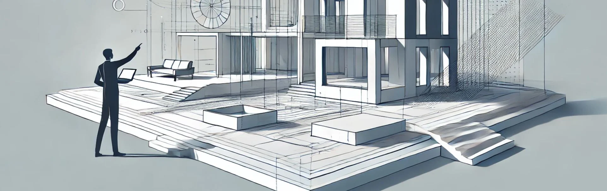

# 30. Introducción a Revit para Diseño Paramétrico

**Revit**, desarrollado por Autodesk, es una de las plataformas líderes en el mundo del diseño y modelado de edificios, y su capacidad para
trabajar con **diseño paramétrico** lo convierte en una herramienta esencial para arquitectos, ingenieros y diseñadores que buscan crear
proyectos complejos de manera eficiente y precisa. Revit no es solo un programa de dibujo; es un entorno de **Building Information Modeling (BIM)**,
lo que significa que gestiona de manera integrada la geometría, las relaciones espaciales y los datos del proyecto, facilitando la
coordinación y el control en todas las fases de diseño, documentación y construcción.

En este artículo, exploraremos los conceptos clave de **Revit** en el contexto del **diseño paramétrico**, y cómo puedes comenzar a utilizar
sus herramientas para desarrollar proyectos paramétricos adaptativos que respondan a las necesidades de funcionalidad, eficiencia y estética.

## 1. ¿Qué es el diseño paramétrico en Revit?

El **diseño paramétrico** en Revit se refiere a la capacidad de crear modelos 3D que están controlados por **parámetros** que definen su
geometría y comportamiento. Los parámetros son variables ajustables que permiten modificar el diseño sin necesidad de redibujar o modelar de
nuevo. Esto significa que los elementos arquitectónicos y estructurales creados en Revit (como paredes, ventanas, puertas, techos y escaleras)
pueden ajustarse automáticamente en función de las relaciones y restricciones que el usuario defina previamente.

A diferencia de otros programas de modelado 3D, en los que el enfoque se centra más en la forma pura, en Revit, los parámetros también incluyen
datos no gráficos, como **materiales**, **costos**, **cargas estructurales** o **propiedades de energía**, lo que permite a los
diseñadores no solo generar geometría dinámica, sino también manejar información vital para la gestión del proyecto.

## 2. Interfaz de Revit: Introducción al entorno de trabajo

Al abrir Revit, notarás que su entorno de trabajo es organizado y fácil de navegar, lo que permite trabajar de manera eficiente en proyectos
arquitectónicos y de diseño paramétrico. Aquí están los elementos clave de la interfaz de Revit:

* **Ribbon (Cinta de herramientas)**: La cinta de herramientas en la parte superior contiene todas las funciones principales de Revit, organizadas en pestañas como "Architecture", "Structure", "Insert", "Annotate" y más. Cada pestaña está subdividida en secciones que agrupan las herramientas según su función (modelado, documentación, análisis, etc.).

* **Propiedades**: El panel de propiedades permite ver y ajustar los parámetros de cualquier elemento seleccionado en el modelo. Aquí puedes modificar dimensiones, materiales, parámetros estructurales y más.

* **Paleta de Proyecto (Project Browser)**: En esta paleta puedes acceder a todas las vistas, planos, secciones, elevaciones y familias del proyecto. Es esencial para navegar por el modelo y trabajar en diferentes partes del proyecto de manera rápida.

* **Ventana de vistas**: La ventana de vistas es donde se representa gráficamente el modelo en diferentes vistas, como en planta, en sección o en 3D. Puedes tener varias vistas abiertas a la vez, lo que facilita la revisión y edición simultánea desde diferentes perspectivas.

## 3. Elementos paramétricos en Revit: Familias y componentes

En Revit, los elementos paramétricos se crean principalmente a través de **familias**. Las familias son los bloques de construcción de cualquier
modelo en Revit y están completamente parametrizadas, lo que significa que puedes ajustar su geometría, propiedades y comportamiento en función
de los parámetros definidos. Existen tres tipos principales de familias en Revit:

### a) Familias de sistema

Estas familias son predefinidas dentro de Revit y se utilizan para crear elementos constructivos comunes, como **paredes**, **techos**, **suelos**
y **cubiertas**. Estas familias pueden modificarse ajustando sus parámetros, como el espesor, la altura o los materiales, permitiendo que
se adapten automáticamente a las dimensiones y condiciones del proyecto.

Por ejemplo, si ajustas el espesor de una pared o la inclinación de una cubierta, todo el diseño se actualiza automáticamente para reflejar estos
cambios, lo que facilita la iteración en los proyectos sin perder consistencia.

### b) Familias cargables

Las **familias cargables** son objetos independientes que puedes crear o cargar en tu proyecto, como **mobiliario**, **ventanas**, **puertas** o
**luminarias**. Estas familias pueden ser altamente personalizables y tienen parámetros que permiten cambiar sus dimensiones, materiales o
configuraciones específicas.

Por ejemplo, una familia de ventana puede tener parámetros para ajustar el ancho, la altura y el número de divisiones de la ventana. Si necesitas
cambiar el tamaño de todas las ventanas de un proyecto, puedes hacerlo de forma simultánea ajustando los parámetros, y Revit actualizará todas
las instancias de esa ventana en el proyecto automáticamente.

### c) Familias in situ

Las **familias in situ** son elementos personalizados que se crean directamente dentro del proyecto. Estas familias son útiles cuando
necesitas diseñar elementos únicos que solo aparecerán una vez en el proyecto, como una pieza decorativa compleja o un mueble a medida.

## 4. Diseño paramétrico avanzado con "Families Editor"

Para llevar el diseño paramétrico en Revit al siguiente nivel, es importante aprender a usar el **Editor de Familias (Families Editor)**.
Este editor te permite crear familias personalizadas y establecer **parámetros** específicos que controlen su geometría y comportamiento. A
continuación, se detallan algunos pasos básicos para comenzar a crear tus propias familias paramétricas:

### Paso 1: Crear una nueva familia

* Ve a "File" y selecciona "New" y luego "Family" para abrir el Editor de Familias. A partir de aquí, puedes seleccionar la plantilla de familia que mejor se adapte a tu proyecto (por ejemplo, "Door", "Window", "Furniture").

### Paso 2: Definir parámetros de la familia

* En el Editor de Familias, puedes comenzar a **modelar** la geometría de la familia utilizando las herramientas de creación de formas, como **Extrude** (Extrusión), **Revolve** (Revolución) o **Sweep**. Sin embargo, lo que realmente hace poderosa a una familia es la posibilidad de agregar **parámetros** para controlar su geometría.

* Haz clic en el botón "Family Types" para agregar parámetros. Por ejemplo, puedes crear un parámetro para el ancho y la altura de una ventana. Estos parámetros se pueden vincular a las dimensiones de la geometría de la familia, lo que permite que la forma de la ventana cambie cuando los parámetros sean ajustados.

### Paso 3: Configurar restricciones

* Utiliza las **restricciones** y **alineaciones** para definir relaciones entre diferentes partes de la geometría. Por ejemplo, puedes vincular la altura de una mesa con su largo, de manera que cuando se cambie uno de los parámetros, la forma completa de la mesa se actualice de manera proporcional.

### Paso 4: Guardar y cargar en el proyecto

* Una vez que hayas creado la familia y establecido los parámetros, puedes guardar la familia y cargarla en tu proyecto. Esto te permite utilizar la familia en varias ubicaciones dentro del modelo y ajustar los parámetros según sea necesario.

## 5. Flujos de trabajo paramétricos eficientes en Revit

Para desarrollar un flujo de trabajo paramétrico eficiente en Revit, es importante seguir algunos principios clave que te permitirán gestionar
mejor los parámetros, la información del proyecto y la coordinación entre equipos:

### a) Definir parámetros globales

Revit te permite establecer **parámetros globales** que pueden aplicarse en todo el proyecto. Estos parámetros pueden controlar aspectos como alturas, dimensiones o materiales que afecten a varios elementos del modelo. Usar parámetros globales es útil para proyectos de gran escala, donde es necesario ajustar varios elementos al mismo tiempo.

### b) Crear familias bien organizadas

Al diseñar una familia paramétrica, asegúrate de mantenerla bien organizada. Usa nombres descriptivos para los parámetros y agrúpalos
lógicamente. Esto facilitará la edición posterior y permitirá que otros miembros del equipo entiendan cómo funciona la familia.

### c) Vinculación de parámetros con otros elementos

Una característica avanzada de Revit es la posibilidad de **vincular parámetros** de una familia a otros elementos del modelo. Por ejemplo,
puedes vincular la altura de una barandilla con la altura de una escalera, de manera que ambos elementos se actualicen automáticamente si
uno de los parámetros cambia.

### d) Uso de fórmulas

En Revit, puedes utilizar **fórmulas** para crear relaciones entre diferentes parámetros. Por ejemplo, puedes hacer que el área de una
ventana sea siempre un porcentaje del área de la pared en la que está inserta. Las fórmulas son útiles para mantener la consistencia del diseño
mientras ajustas los parámetros.