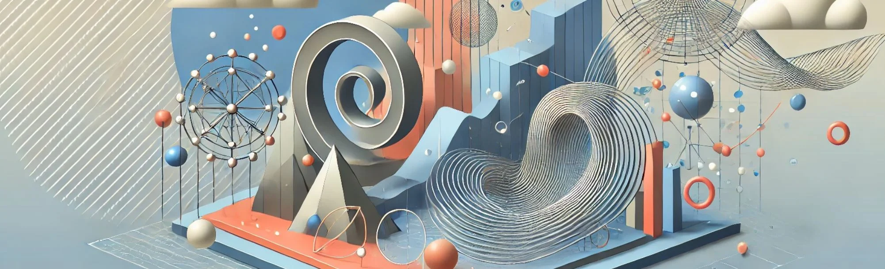

# 37. Tendencias Emergentes en Diseño Paramétrico

El **diseño paramétrico** ha revolucionado el campo de la arquitectura, el diseño de interiores, el urbanismo y el diseño industrial, ofreciendo
nuevas formas de crear estructuras complejas, adaptables y eficientes. A medida que esta metodología continúa evolucionando, surgen
**tendencias emergentes** que están redefiniendo lo que es posible en el ámbito del diseño. Estas tendencias no solo están impulsadas por avances
tecnológicos, sino también por la creciente demanda de **sostenibilidad**, **personalización** y **eficiencia** en los procesos
creativos y de fabricación.

En este artículo, exploraremos algunas de las principales tendencias emergentes en el diseño paramétrico, destacando cómo están influyendo en
la forma en que se diseñan y construyen los espacios y productos.

## 1. **Sostenibilidad Paramétrica**

Una de las tendencias más importantes en el diseño paramétrico es la integración de estrategias sostenibles en el proceso de diseño. Los
algoritmos paramétricos permiten a los arquitectos y diseñadores **optimizar** sus proyectos para minimizar el impacto ambiental, reducir
el uso de materiales y mejorar la eficiencia energética.

### a) Optimización de recursos y eficiencia energética

El diseño paramétrico permite optimizar la **orientación de los edificios**, la disposición de ventanas, y la geometría de las fachadas
para maximizar el uso de la luz natural y reducir la demanda de energía. Esto se puede lograr mediante el uso de algoritmos que ajustan
automáticamente el diseño en función de los **datos climáticos** y las simulaciones de rendimiento energético.

Por ejemplo, herramientas como **Ladybug** y **Honeybee** en Grasshopper permiten realizar simulaciones detalladas de **radiación solar** y
**ventilación natural**, lo que ayuda a los diseñadores a crear edificios más eficientes. Estas simulaciones pueden integrarse en el
flujo de trabajo paramétrico, permitiendo que el diseño se ajuste automáticamente para optimizar el rendimiento energético a lo largo del
tiempo.

### b) Materiales sostenibles y fabricación digital

El uso de materiales sostenibles y la **fabricación digital** también están estrechamente vinculados con el diseño paramétrico. La
**impresión 3D** y otras tecnologías de fabricación aditiva permiten utilizar materiales reciclados y minimizar el desperdicio, mientras que
los algoritmos paramétricos optimizan las formas para reducir el uso de material sin comprometer la integridad estructural.

En proyectos de diseño de producto, por ejemplo, el diseño paramétrico puede generar **mallas ligeras** y estructuras porosas que maximizan la
eficiencia del material, reduciendo el peso total del producto y el consumo de recursos en la fabricación.

## 2. **Diseño Generativo y Aprendizaje Automático (Machine Learning)**

El **diseño generativo** es una tendencia emergente que se basa en el uso de **algoritmos evolutivos** para generar múltiples soluciones de
diseño, optimizarlas en función de restricciones específicas y seleccionar las mejores opciones. Esto está estrechamente relacionado con
el uso de **inteligencia artificial (IA)** y **aprendizaje automático (machine learning)**, que permite a las máquinas aprender de datos
anteriores y mejorar los resultados de diseño.

### a) Algoritmos generativos para la exploración formal

El diseño generativo permite a los diseñadores explorar un **número ilimitado de opciones de diseño**, ajustando parámetros como forma,
tamaño, peso, costo y sostenibilidad. Esto es particularmente útil en proyectos arquitectónicos complejos, donde la interacción de múltiples
variables puede hacer que encontrar la solución óptima sea un desafío.

Por ejemplo, en el diseño de **rascacielos** o **puentes**, los algoritmos generativos pueden generar automáticamente cientos de
configuraciones estructurales que luego se optimizan en función de criterios como la **resistencia**, el **uso de materiales** o la
**eficiencia energética**. Los diseñadores pueden seleccionar la solución que mejor se ajuste a los objetivos del proyecto, ahorrando
tiempo y mejorando la calidad del diseño.

### b) Aprendizaje automático para mejorar la personalización

El uso de **machine learning** en el diseño paramétrico está comenzando a permitir una **personalización avanzada** de los proyectos. A través
del análisis de grandes cantidades de datos, como preferencias de usuarios, condiciones climáticas o históricos de rendimiento, los
algoritmos pueden aprender de los resultados previos y ajustar los parámetros del diseño de manera más precisa.

Por ejemplo, en el diseño de **interiores personalizados**, el aprendizaje automático puede ayudar a predecir qué configuraciones de
mobiliario o distribución espacial son más adecuadas para los usuarios en función de sus comportamientos o necesidades específicas.

## 3. **Fabricación Robótica y Construcción Automatizada**

El avance en la **fabricación robótica** y la **automatización en la construcción** está teniendo un impacto significativo en el diseño
paramétrico. Estas tecnologías permiten una mayor precisión y velocidad en la construcción de estructuras complejas, lo que es ideal para los
proyectos que se benefician del enfoque paramétrico.

### a) Robots de construcción y fabricación aditiva a gran escala

Los **robots de construcción** están comenzando a ser utilizados para construir estructuras paramétricas directamente en el sitio. Por ejemplo,
robots que colocan ladrillos, ensamblan módulos prefabricados o imprimen estructuras de hormigón en 3D son cada vez más comunes en proyectos
arquitectónicos avanzados.

Estas tecnologías permiten construir formas y geometrías complejas que serían imposibles o extremadamente costosas de fabricar con métodos
tradicionales. Además, la combinación de algoritmos paramétricos y fabricación robótica permite una **fabricación adaptativa**, donde los
robots ajustan su comportamiento en función de las condiciones reales en el sitio de construcción.

### b) Integración de algoritmos con robots

El **control de robots** mediante algoritmos paramétricos es una tendencia en crecimiento. Esto permite que los robots construyan
estructuras dinámicas y altamente personalizadas. Por ejemplo, en la construcción de fachadas modulares o cubiertas ligeras, los robots pueden
ajustar el posicionamiento y la colocación de los elementos en función de los parámetros establecidos por los diseñadores.

## 4. **Interfaces Inteligentes e Interactivas**

El diseño paramétrico ya no se limita a la forma física o estructural; cada vez más, las **interfaces inteligentes** y las
**superficies interactivas** están integrándose en el diseño arquitectónico y de interiores. Estas tecnologías permiten que los
edificios y objetos se adapten a las necesidades de los usuarios en tiempo real, ofreciendo una experiencia más personalizada y conectada.

### a) Diseño de espacios interactivos

Los **espacios interactivos** son una tendencia clave en la arquitectura paramétrica. Utilizando sensores y algoritmos paramétricos, las
superficies arquitectónicas pueden reaccionar a los cambios en el entorno, como la luz, el sonido o el movimiento de las personas. Por
ejemplo, las fachadas paramétricas pueden ajustar sus elementos de sombreado en función de la radiación solar, o los techos pueden cambiar
de forma para mejorar la acústica en una sala de conciertos.

En el ámbito del diseño de interiores, los **mobiliarios inteligentes** pueden ajustar su configuración para adaptarse a diferentes actividades,
como escritorios que cambian de altura automáticamente según las necesidades de los usuarios.

### b) Integración de tecnología IoT y datos en tiempo real

La **Internet de las Cosas (IoT)** y los datos en tiempo real están desempeñando un papel importante en esta tendencia. Los edificios
paramétricos están comenzando a integrar sensores IoT que recopilan datos sobre el entorno y los ocupantes, y los algoritmos paramétricos
utilizan estos datos para ajustar los elementos del diseño automáticamente.

Por ejemplo, un edificio con una fachada inteligente puede utilizar sensores climáticos para ajustar el nivel de sombreado en tiempo real,
mejorando la eficiencia energética y la comodidad de los ocupantes.

## 5. **Diseño Paramétrico Bioinspirado y Biomimético**

El diseño bioinspirado y biomimético, que toma inspiración de los sistemas y procesos naturales, es una tendencia emergente dentro del
diseño paramétrico. Los algoritmos paramétricos permiten a los diseñadores emular patrones y formas que se encuentran en la naturaleza,
lo que lleva a la creación de estructuras más eficientes y estéticamente atractivas.

### a) Geometrías inspiradas en la naturaleza

La **geometría fractal**, las **estructuras de conchas** y las **configuraciones de colmenas** son algunos ejemplos de cómo los patrones
naturales están influyendo en el diseño paramétrico. Estos patrones permiten crear estructuras que son ligeras, fuertes y eficientes en
términos de materiales.

Por ejemplo, el uso de estructuras basadas en **paneles hexagonales**, inspiradas en las colmenas de abejas, se ha popularizado en el diseño de
fachadas, techos y mobiliario debido a su capacidad para proporcionar una alta resistencia con un mínimo uso de material.

### b) Biomimética para la sostenibilidad

El diseño biomimético también está impulsando innovaciones en la sostenibilidad. Al imitar los procesos naturales, los edificios y
productos diseñados de manera paramétrica pueden mejorar su rendimiento ambiental. Por ejemplo, los edificios que imitan la
**ventilación natural de los termiteros** pueden reducir la necesidad de aire acondicionado y mejorar la circulación de aire en el interior.