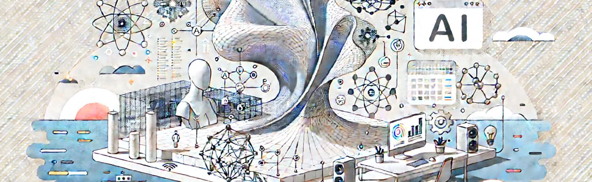

# 38. El Futuro del Diseño: Integración con Inteligencia Artificial

La **integración de la Inteligencia Artificial (IA)** en el diseño está transformando radicalmente la manera en que los arquitectos, diseñadores
de interiores y creativos abordan sus proyectos. Al combinar los procesos de **diseño paramétrico** con la **IA**, los profesionales
pueden generar soluciones más inteligentes, eficientes y personalizadas que antes solo podían imaginar. Esta tecnología está allanando el camino
hacia una nueva era del diseño, donde las máquinas no solo asisten en la creación de formas y geometrías, sino que también **aprenden**,
**predicen** y **optimizan** soluciones basadas en grandes conjuntos de datos y en la evolución de las necesidades del usuario.

El futuro del diseño a través de la IA promete integrar creatividad humana con el poder del procesamiento de datos y el análisis avanzado,
generando entornos construidos más adaptativos, sostenibles y receptivos. En este artículo, exploraremos cómo la **inteligencia artificial**
está influenciando el campo del diseño paramétrico, qué tecnologías están impulsando esta transformación y hacia dónde se dirige esta
tendencia.

## 1. **Automatización Avanzada del Diseño**

Uno de los aspectos más transformadores de la IA en el diseño es la capacidad de **automatizar** muchas de las tareas que tradicionalmente
han requerido la intervención manual de los diseñadores. Esto no solo incluye la generación de geometrías complejas, sino también la
optimización de parámetros múltiples y la resolución de problemas arquitectónicos y de diseño en tiempo real.

### a) Algoritmos Generativos Inteligentes

El uso de **algoritmos generativos** impulsados por IA permite a los diseñadores crear un número ilimitado de opciones de diseño en función de
criterios establecidos, como costos, sostenibilidad, estética y funcionalidad. Estos algoritmos pueden explorar una amplia gama de
soluciones y luego seleccionar las que mejor se alineen con los objetivos del proyecto.

Por ejemplo, los sistemas generativos inteligentes pueden ayudar a optimizar el diseño de un **rascacielos** teniendo en cuenta la
resistencia estructural, la distribución de los espacios interiores, la eficiencia energética y el presupuesto, generando miles de variantes
antes de seleccionar las más adecuadas.

### b) Optimización en tiempo real

La IA también está facilitando la **optimización en tiempo real** en los flujos de trabajo paramétricos. Con la capacidad de procesar datos
complejos al instante, los algoritmos basados en IA pueden ajustar automáticamente los parámetros del diseño para cumplir con las
restricciones impuestas, como la maximización de la luz natural o la minimización de los costos de construcción. Este enfoque también permite
ajustar un diseño sobre la marcha, respondiendo a los cambios en las condiciones del proyecto o del sitio.

## 2. **Aprendizaje Automático (Machine Learning) para la Personalización del Diseño**

El **aprendizaje automático** es una de las aplicaciones más prometedoras de la IA en el diseño paramétrico. A través del análisis de
grandes conjuntos de datos, los algoritmos de **machine learning** pueden identificar patrones y aprender de ellos, lo que permite a los
sistemas de IA hacer predicciones y sugerencias para mejorar el diseño y la experiencia del usuario.

### a) Diseño personalizado y predictivo

Una de las principales ventajas del aprendizaje automático es su capacidad para generar **diseños personalizados** en función de las
preferencias de los usuarios o las condiciones del entorno. Por ejemplo, en el diseño de interiores, un sistema basado en IA podría analizar las
preferencias de un cliente y generar automáticamente varias configuraciones espaciales adaptadas a su estilo y necesidades,
sugiriendo combinaciones de colores, materiales y muebles que se ajusten a su personalidad.

En la arquitectura, los algoritmos de IA pueden aprender de los patrones de comportamiento de los usuarios de un edificio y ajustar las
características del diseño, como la disposición de los espacios comunes o el control de la climatización, para optimizar la comodidad y la
eficiencia energética.

### b) Adaptación a cambios y retroalimentación

El aprendizaje automático también permite que los **diseños evolutivos** se adapten en función de la retroalimentación del usuario o de cambios en
las condiciones del entorno. Por ejemplo, un edificio equipado con sensores IoT puede recopilar datos sobre cómo los ocupantes utilizan los
espacios a lo largo del tiempo y, basándose en esos datos, el algoritmo puede ajustar dinámicamente la distribución de los espacios o la
configuración de la iluminación y la climatización para mejorar la experiencia de los usuarios.

Este enfoque adaptativo también permite la creación de **mobiliario inteligente** que puede ajustarse automáticamente a las preferencias de
uso de los usuarios, cambiando su forma o funcionalidad en respuesta a sus necesidades.

## 3. **Colaboración Hombre-Máquina: Diseño Co-creativo**

El futuro del diseño no está enfocado únicamente en la automatización total, sino en una **colaboración entre humanos e IA**. En este
escenario, los diseñadores y las máquinas trabajan juntos para crear soluciones innovadoras. La IA puede proporcionar sugerencias,
optimizaciones y análisis basados en datos, mientras que los diseñadores humanos conservan el control creativo y la toma de decisiones.

### a) IA como asistente de diseño

Las **herramientas de IA** están comenzando a desempeñar el papel de **asistentes de diseño**, proporcionando sugerencias basadas en datos y
ayudando a resolver problemas de diseño específicos. Por ejemplo, una IA podría analizar una disposición espacial y sugerir cambios para mejorar
el flujo de circulación o la distribución de la luz natural. Estas sugerencias pueden ser adoptadas o modificadas por el diseñador humano,
lo que resulta en un proceso de diseño más rápido y eficiente.

Al integrar sistemas de **realidad aumentada (AR)** o **realidad virtual (VR)**, la IA puede guiar a los diseñadores en un entorno inmersivo,
proporcionando análisis en tiempo real y mostrando las implicaciones de diferentes decisiones de diseño en la estética y funcionalidad del proyecto.

### b) Procesos iterativos más rápidos

La IA permite iterar más rápidamente a través de diferentes opciones de diseño. En lugar de realizar manualmente cientos de cambios en un diseño,
los diseñadores pueden establecer reglas y parámetros para que la IA genere y evalúe automáticamente múltiples variantes de un proyecto. Esto
permite que el proceso de diseño evolucione de manera más ágil, con el diseñador centrado en la validación y refinamiento de las soluciones más
prometedoras.

## 4. **Modelado Predictivo para la Sostenibilidad**

La sostenibilidad es un factor crítico en la arquitectura y el diseño contemporáneos, y la IA está desempeñando un papel importante en la
**predicción del rendimiento** ambiental y la optimización de los proyectos para que sean más ecológicos y eficientes en términos de
energía.

### a) Predicción del comportamiento energético

Uno de los mayores beneficios de la IA es su capacidad para realizar simulaciones predictivas precisas del **comportamiento energético** de un
edificio. Mediante el uso de datos históricos, simulaciones climáticas y análisis de comportamiento humano, los algoritmos de IA pueden predecir
cómo un edificio consumirá energía a lo largo del tiempo y sugerir modificaciones para reducir su impacto ambiental.

Por ejemplo, una IA puede analizar la orientación del edificio, el tamaño y ubicación de las ventanas, y los materiales utilizados, y luego
sugerir cambios que reduzcan la ganancia térmica en climas cálidos o mejoren el aislamiento en climas fríos. Estas predicciones pueden ayudar
a los arquitectos a tomar decisiones más informadas sobre el diseño, mejorando la sostenibilidad del proyecto sin sacrificar la estética o la
funcionalidad.

### b) Optimización del uso de materiales

Los algoritmos de IA también pueden ayudar a optimizar el uso de **materiales sostenibles**, minimizando el desperdicio en el proceso de
construcción. La IA puede analizar cómo los materiales son utilizados en diferentes partes de un edificio y sugerir formas más eficientes de
ensamblar o fabricar componentes. Esto no solo reduce los costos, sino que también disminuye el impacto ambiental asociado con la construcción.

## 5. **IA y Fabricación Digital**

La integración de la IA con **tecnologías de fabricación digital** está transformando la forma en que se producen y construyen los proyectos. La
**fabricación aditiva (impresión 3D)**, la **construcción robótica** y los **sistemas de construcción automatizados** están comenzando a ser
controlados y optimizados por algoritmos de IA, lo que permite crear formas y estructuras cada vez más complejas y adaptativas.

### a) Fabricación personalizada a escala

La **impresión 3D** a gran escala y la fabricación robótica controlada por IA están permitiendo la creación de formas personalizadas a una
escala sin precedentes. Las máquinas pueden ajustar el proceso de construcción en tiempo real, modificando los parámetros de impresión o
ensamblaje para cumplir con las especificaciones del diseño y garantizar que el producto final sea preciso y eficiente.

Por ejemplo, robots autónomos pueden construir fachadas modulares que se ajusten a la radiación solar o al flujo de aire en función de datos en
tiempo real, garantizando un uso óptimo de los recursos durante la construcción.

### b) IA para la optimización estructural

La IA también está siendo utilizada para **optimizar estructuras complejas** durante el proceso de fabricación. Los algoritmos pueden
analizar la estabilidad y el comportamiento estructural de una forma, ajustando los materiales y la geometría para garantizar que sea lo
suficientemente fuerte y ligera al mismo tiempo. Esta optimización no solo reduce los costos de construcción, sino que también permite crear
estructuras que de otro modo serían imposibles con métodos tradicionales.