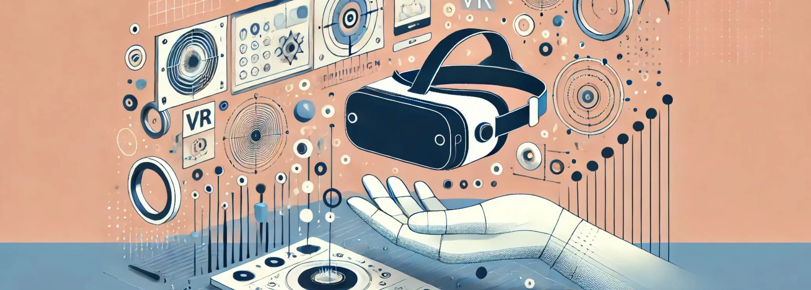

# 39. Realidad Virtual y Aumentada en el Diseño Paramétrico

La **Realidad Virtual (VR)** y la **Realidad Aumentada (AR)** están revolucionando el diseño paramétrico al ofrecer nuevas formas de
interactuar con modelos y geometrías complejas en tiempo real. Estas tecnologías no solo mejoran la capacidad de visualizar y comprender los
proyectos tridimensionales, sino que también permiten a los diseñadores, arquitectos y clientes experimentar de manera inmersiva y participativa
el proceso de diseño, optimizando la toma de decisiones y mejorando la comunicación entre las partes interesadas.

El uso de VR y AR en el diseño paramétrico está impulsando una transformación significativa en cómo se diseñan, evalúan y construyen los
proyectos, ya que ofrecen un entorno digital interactivo que facilita la creación de espacios más inteligentes, adaptativos y personalizados. En
este artículo, exploraremos cómo estas tecnologías están influyendo en el campo del diseño paramétrico, sus aplicaciones clave y cómo están
redefiniendo el proceso creativo y de construcción.

## 1. **Visualización Inmersiva en Tiempo Real**

Uno de los usos más impactantes de la realidad virtual en el diseño paramétrico es la capacidad de **visualizar modelos 3D en tiempo real** y
de manera inmersiva. Esto significa que los diseñadores, clientes y colaboradores pueden experimentar los proyectos a escala y desde
múltiples perspectivas, permitiendo una evaluación más detallada de la forma, la estética y la funcionalidad de los espacios.

### a) Exploración de modelos paramétricos en VR

La **Realidad Virtual (VR)** ofrece una experiencia completamente inmersiva, en la que los usuarios pueden recorrer los espacios diseñados
y experimentar la interacción de luz, materiales, colores y proporciones a escala real. Esto es especialmente útil en el diseño paramétrico, donde
los modelos suelen ser complejos y multifacéticos, y donde los detalles de la geometría pueden ser difíciles de visualizar con precisión en una
pantalla 2D.

Por ejemplo, en el diseño de un edificio con geometrías complejas generadas algorítmicamente, los usuarios pueden colocarse en diferentes
áreas del modelo VR y ver cómo las formas paramétricas influyen en la circulación, la entrada de luz natural o la sensación espacial general.
La capacidad de experimentar estos detalles de forma interactiva permite realizar ajustes más precisos antes de pasar a la fase de construcción.

### b) Pruebas funcionales en entornos inmersivos

Además de la visualización, la VR también permite realizar pruebas **funcionales** de los diseños en un entorno inmersivo. Esto incluye
evaluar cómo los usuarios interactuarán con el espacio, cómo los muebles y objetos se ajustan a la ergonomía o cómo las personas se moverán por un
entorno. Por ejemplo, en el diseño de interiores paramétrico, los diseñadores pueden probar diferentes configuraciones de mobiliario y
distribución espacial para maximizar la comodidad y funcionalidad, todo dentro de un entorno virtual.

## 2. **Realidad Aumentada para la Evaluación In-Situ**

La **Realidad Aumentada (AR)** permite superponer modelos 3D digitales sobre el entorno físico real, lo que facilita la evaluación y comparación
de diseños paramétricos directamente en el contexto donde se implementarán. Esto es especialmente valioso en proyectos arquitectónicos
y urbanos, donde es crucial entender cómo una nueva estructura o espacio se integrará con su entorno físico inmediato.

### a) Superposición de modelos paramétricos en entornos reales

Una de las aplicaciones más comunes de AR en el diseño paramétrico es la **superposición de modelos digitales** sobre el entorno real. Utilizando
dispositivos móviles, tabletas o gafas de AR, los diseñadores y clientes pueden ver una proyección en tiempo real de una estructura, fachada o
mobiliario en el sitio donde será implementado. Esta capacidad ayuda a verificar si el diseño se ajusta adecuadamente al espacio, el entorno y
las condiciones del lugar.

Por ejemplo, en el caso de una fachada paramétrica diseñada para un edificio en una zona urbana densa, los arquitectos pueden superponer el
modelo digital sobre la fachada real existente para evaluar cómo las nuevas geometrías afectarán el entorno urbano, cómo interactuarán con la
luz solar en diferentes momentos del día y cómo se integrarán con los edificios circundantes.

### b) Ajustes y modificaciones en tiempo real

Una de las mayores ventajas de la AR es que permite realizar **ajustes en tiempo real**. Al visualizar el diseño sobre el sitio real, los
diseñadores pueden detectar problemas de escala, ubicación o integración antes de que se inicien las fases de construcción. Esto facilita la
modificación instantánea del diseño paramétrico, ajustando las dimensiones o los parámetros de la geometría para garantizar que el
proyecto final sea coherente con las condiciones del entorno físico.

Por ejemplo, si se detecta que una parte del diseño interfiere con una infraestructura existente o si el espacio proyectado no cumple con las
expectativas espaciales, los ajustes pueden realizarse directamente en el modelo paramétrico, proporcionando una flexibilidad crucial durante
las fases preliminares del proyecto.

## 3. **Colaboración en Tiempo Real y Toma de Decisiones**

La VR y AR no solo mejoran la visualización y el análisis del diseño, sino que también facilitan la **colaboración en tiempo real** entre los
miembros del equipo, independientemente de su ubicación física. Las plataformas de VR y AR permiten que los diseñadores, ingenieros y
clientes se reúnan virtualmente en un espacio compartido para revisar los modelos y tomar decisiones conjuntas de manera eficiente.

### a) Revisión colaborativa de proyectos en VR

En entornos colaborativos de realidad virtual, múltiples usuarios pueden interactuar simultáneamente con un modelo paramétrico, hacer comentarios,
sugerir cambios y evaluar el diseño desde diferentes ángulos. Esto es especialmente útil en proyectos de gran escala o internacionales, donde
los equipos pueden estar distribuidos en diferentes ubicaciones geográficas.

Por ejemplo, en la planificación de un desarrollo urbano, los diseñadores pueden explorar cómo los diferentes componentes del plan
maestro se interrelacionan y discutir ajustes en tiempo real, todo dentro de un entorno virtual compartido. Esto agiliza la toma de
decisiones y mejora la comunicación entre las partes interesadas.

### b) Toma de decisiones más informada

La capacidad de experimentar un modelo paramétrico de manera inmersiva en VR o superponerlo en un entorno real mediante AR ofrece una forma más
**tangible** y **realista** de entender los impactos del diseño, lo que a su vez mejora la toma de decisiones. Al ver un diseño a escala 1:1 en
un entorno virtual o real, los clientes y diseñadores pueden evaluar con mayor precisión la viabilidad del proyecto, lo que reduce las
posibilidades de malentendidos y retrabajos costosos en fases posteriores.

## 4. **Simulaciones y Experimentos Paramétricos Inmersivos**

Las capacidades de VR y AR permiten llevar a cabo **simulaciones paramétricas avanzadas** que permiten a los diseñadores experimentar con
diferentes parámetros y ver cómo afectan el rendimiento del proyecto en un entorno inmersivo.

### a) Simulación de condiciones ambientales

Uno de los usos más poderosos de VR en el diseño paramétrico es la simulación de **condiciones ambientales** en tiempo real. En un entorno
virtual, los diseñadores pueden experimentar cómo los cambios en los parámetros de diseño, como la orientación de una fachada, el tamaño de
las ventanas o los materiales utilizados, afectarán el rendimiento del edificio en diferentes condiciones climáticas.

Por ejemplo, una fachada paramétrica podría ajustarse para optimizar la entrada de luz natural mientras se minimiza la ganancia de calor en
climas cálidos. Utilizando VR, los diseñadores pueden simular el recorrido del sol durante diferentes momentos del día o estaciones del
año, verificando visualmente cómo los cambios en la geometría afectan el comportamiento ambiental del edificio.

### b) Interacción paramétrica con los usuarios

En algunos casos, los espacios diseñados paramétricamente deben **interactuar dinámicamente con los usuarios**. Las superficies
adaptativas o las instalaciones artísticas paramétricas, por ejemplo, pueden ajustarse en función de la proximidad o movimiento de los
usuarios. La realidad aumentada permite simular estas interacciones en el mundo físico, donde los usuarios pueden experimentar de primera mano
cómo los elementos del diseño paramétrico responden a sus acciones.

Por ejemplo, una instalación paramétrica de arte que cambia de forma según el movimiento de las personas puede probarse con AR, permitiendo a
los diseñadores y artistas evaluar el comportamiento de los algoritmos y ajustar los parámetros en tiempo real para mejorar la experiencia del
usuario.

## 5. **Prototipado Virtual para Fabricación Digital**

El uso de VR y AR también está impulsando una evolución en el **prototipado virtual**, especialmente en combinación con la
**fabricación digital**. Al permitir a los diseñadores visualizar y experimentar sus modelos paramétricos antes de la producción física,
estas tecnologías están optimizando el proceso de diseño y fabricación.

### a) Validación de prototipos antes de la fabricación

Antes de iniciar el proceso de fabricación, la VR permite a los diseñadores verificar y validar sus modelos paramétricos, asegurando que
las dimensiones, formas y detalles sean correctos. Esta capacidad de visualizar un **prototipo virtual** en un entorno inmersivo ayuda a
reducir errores y mejorar la precisión en el producto final.

Por ejemplo, en el diseño de mobiliario paramétrico, los diseñadores pueden evaluar cómo las formas curvilíneas o los patrones complejos se
comportarán en el mundo físico, ajustando los detalles antes de proceder con la fabricación digital en CNC o impresión 3D.