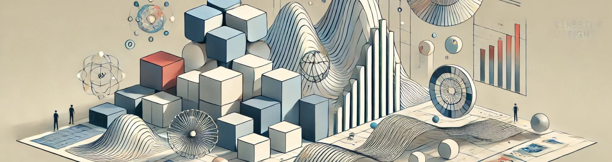

# 40. Diseño Generativo: La Próxima Frontera

El **diseño generativo** está emergiendo como una de las tecnologías más disruptivas en la arquitectura, el diseño de interiores, el diseño
industrial y otras disciplinas creativas. A diferencia de los enfoques tradicionales, en los que los diseñadores crean soluciones específicas a
partir de su intuición y habilidades, el diseño generativo utiliza **algoritmos** para explorar un vasto espacio de soluciones, optimizando
cada una de ellas en función de múltiples restricciones y objetivos. Esta metodología no solo permite generar una gran cantidad de opciones de
diseño, sino que también optimiza estas opciones para lograr mejores resultados en términos de sostenibilidad, eficiencia estructural, costos,
estética y funcionalidad.

El diseño generativo está impulsado por el poder de la **inteligencia artificial (IA)** y los **algoritmos evolutivos**, lo que lo convierte en
una herramienta invaluable para la resolución de problemas complejos que requieren adaptabilidad y optimización a gran escala. En este artículo,
exploraremos cómo funciona el diseño generativo, sus aplicaciones clave, y cómo está transformando el futuro del diseño, abriendo nuevas fronteras
en la creatividad y la innovación.

## 1. ¿Qué es el Diseño Generativo?

El **diseño generativo** es un enfoque de diseño asistido por computadora que permite a los diseñadores y algoritmos trabajar en
conjunto para generar y optimizar soluciones de diseño. En lugar de crear una única solución de diseño, los diseñadores definen un conjunto
de **parámetros**, **condiciones** y **objetivos** (como minimizar el uso de materiales, maximizar la eficiencia estructural o mejorar la
sostenibilidad), y el algoritmo genera múltiples opciones que cumplen con estas restricciones. Los algoritmos utilizan métodos basados en
**inteligencia artificial**, **aprendizaje automático** y **algoritmos genéticos** para ajustar iterativamente las variables y mejorar el diseño.

El proceso puede considerarse como una forma de evolución artificial en la que el diseño "evoluciona" mediante la evaluación de múltiples
variaciones, aplicando criterios de optimización para seleccionar las mejores soluciones.

## 2. ¿Cómo Funciona el Diseño Generativo?

El diseño generativo implica la creación de un **espacio de soluciones** mediante la definición de un conjunto de parámetros, restricciones y
reglas de optimización. A través de un proceso de iteración y análisis, el algoritmo explora este espacio para identificar las soluciones que
mejor cumplen con los objetivos establecidos.

### a) Definición de parámetros y objetivos

El primer paso en el diseño generativo es la **definición de los parámetros** y **objetivos**. Estos pueden incluir una amplia gama de
variables, como dimensiones geométricas, costos de fabricación, resistencia estructural, eficiencia energética, o incluso consideraciones
estéticas. Los diseñadores introducen estos parámetros en el software de diseño generativo, que luego utiliza esta información para generar
automáticamente múltiples configuraciones.

Por ejemplo, en un proyecto arquitectónico, los parámetros podrían incluir la altura del edificio, el número de ventanas, la orientación
solar y la distribución del espacio interior. Los objetivos podrían ser maximizar la luz natural, reducir el consumo de energía y minimizar los
costos de construcción.

### b) Generación de opciones y exploración de soluciones

A partir de los parámetros definidos, el **algoritmo generativo** explora el espacio de diseño, generando múltiples variaciones del
proyecto que cumplen con los criterios establecidos. Estas variaciones pueden ser miles o incluso millones de configuraciones diferentes,
dependiendo de la complejidad del diseño y el número de parámetros involucrados.

El algoritmo no solo genera variaciones al azar, sino que utiliza técnicas de **optimización**, como algoritmos genéticos o métodos de
optimización multicriterio, para mejorar cada opción. A medida que se generan más soluciones, el algoritmo evalúa cada una en función de su
rendimiento respecto a los objetivos planteados, descartando las menos eficientes y refinando las mejores.

### c) Selección de las mejores soluciones

Una vez que se han generado múltiples configuraciones, el diseñador puede **evaluar** y **seleccionar** las mejores soluciones. Las opciones
generadas pueden visualizarse y analizarse en tiempo real, lo que permite al diseñador comparar diferentes soluciones en función de su
rendimiento estructural, eficiencia de recursos o estética. El diseñador también puede ajustar los parámetros o los objetivos para guiar el
proceso hacia una dirección más deseada.

Por ejemplo, en el diseño de un puente, el algoritmo puede generar múltiples configuraciones estructurales, y el diseñador puede seleccionar
la que ofrezca el equilibrio óptimo entre resistencia, uso de materiales y costo de construcción.

## 3. Aplicaciones del Diseño Generativo

El diseño generativo tiene aplicaciones en una amplia gama de disciplinas, desde la arquitectura hasta el diseño industrial, y está
demostrando ser una herramienta valiosa para resolver problemas complejos de manera innovadora.

### a) Arquitectura y Urbanismo

En arquitectura, el diseño generativo está ayudando a crear edificios más eficientes, sostenibles y estéticamente sorprendentes. Al permitir a
los arquitectos optimizar el rendimiento de los edificios en términos de **consumo energético**, **luz natural** y **ventilación**, el diseño
generativo reduce significativamente el tiempo de diseño y mejora la calidad del proyecto.

Uno de los ejemplos más destacados es el **pabellón ICD/ITKE**, diseñado por robots en la Universidad de Stuttgart, donde el diseño generativo
permitió optimizar la geometría del pabellón para minimizar el peso del material y maximizar la estabilidad estructural, inspirándose en los
caparazones de animales marinos.

En el ámbito del **urbanismo**, el diseño generativo se utiliza para planificar de manera óptima el uso del suelo, la disposición de edificios
y espacios públicos, la circulación de vehículos y peatones, y la integración de infraestructuras sostenibles. Los algoritmos pueden
generar configuraciones urbanas que optimizan el flujo de tráfico, maximizan el acceso a espacios verdes y minimizan las emisiones de carbono.

### b) Diseño de Productos y Mobiliario

El diseño generativo está transformando la forma en que se diseñan los productos y el mobiliario, permitiendo crear soluciones personalizadas y
altamente eficientes. Los algoritmos generativos pueden optimizar el **uso de materiales** y reducir el peso de los productos sin comprometer
su resistencia o funcionalidad.

Por ejemplo, el software **Fusion 360** de Autodesk utiliza diseño generativo para crear piezas de productos ligeras pero resistentes,
optimizando la forma en función de las cargas que el producto debe soportar. Este enfoque ha sido utilizado en la industria automotriz y
aeroespacial para crear piezas más ligeras, mejorando la eficiencia energética y reduciendo los costos de producción.

En el diseño de mobiliario, los diseñadores pueden utilizar el diseño generativo para crear estructuras ligeras y adaptativas que se ajusten a
las necesidades ergonómicas y estéticas de los usuarios. Este enfoque permite crear piezas únicas o personalizadas, optimizando el uso de
materiales y la durabilidad.

### c) Diseño Sostenible

El diseño generativo tiene un potencial significativo para mejorar la **sostenibilidad** en el diseño arquitectónico y de productos. Al
permitir la optimización simultánea de múltiples variables, como el consumo de energía, el uso de materiales sostenibles y la eficiencia en
el ciclo de vida de los productos, los diseñadores pueden generar soluciones que reduzcan el impacto ambiental.

Por ejemplo, los algoritmos generativos pueden diseñar edificios que maximicen la ventilación natural y la entrada de luz solar, minimizando
la necesidad de sistemas mecánicos de climatización e iluminación artificial. Además, el diseño generativo permite optimizar el uso de
**materiales reciclables** o **biodegradables**, reduciendo el desperdicio y el impacto ambiental de los productos.

## 4. Ventajas del Diseño Generativo

El diseño generativo ofrece una serie de ventajas clave que lo hacen atractivo para arquitectos, diseñadores de productos y urbanistas:

* **Optimización Multicriterio**: El diseño generativo permite optimizar simultáneamente varios criterios, como la resistencia estructural, la eficiencia de materiales, la sostenibilidad y la estética. Esto significa que los diseñadores pueden generar soluciones que ofrezcan un equilibrio óptimo entre múltiples objetivos.

* **Exploración de Nuevas Soluciones**: Los algoritmos generativos pueden generar soluciones que los diseñadores humanos no habrían considerado. Esto permite la exploración de **nuevas formas**, **patrones** y **configuraciones** que pueden ser más eficientes, innovadoras o visualmente impactantes.

* **Reducción de Tiempo de Diseño**: Al automatizar la generación y evaluación de múltiples opciones, el diseño generativo reduce significativamente el tiempo necesario para desarrollar un proyecto. Esto permite a los diseñadores enfocarse en la **toma de decisiones** estratégicas en lugar de dedicar tiempo a la creación manual de múltiples versiones de un diseño.

* **Soluciones Personalizadas**: El diseño generativo facilita la creación de **soluciones personalizadas** que se adaptan a las necesidades y preferencias específicas de los usuarios. Esto es especialmente valioso en proyectos de diseño de interiores y productos, donde los clientes pueden tener requerimientos únicos.

## 5. El Futuro del Diseño Generativo

El diseño generativo seguirá avanzando a medida que la tecnología de la **inteligencia artificial** y los algoritmos evolutivos continúen
desarrollándose. Con la creciente capacidad de los sistemas de IA para aprender y mejorar con el tiempo, los diseñadores podrán integrar estos
algoritmos en flujos de trabajo más complejos, permitiendo una mayor personalización y optimización de los proyectos.