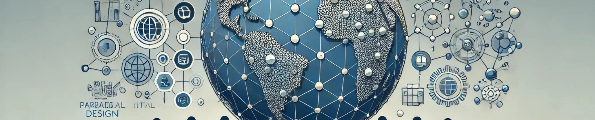

# 41. Redes de Colaboración Global en Diseño Paramétrico

El diseño paramétrico está rompiendo fronteras, no solo en términos de creatividad y tecnología, sino también a través de la creación de
**redes de colaboración global** que permiten a profesionales de todo el mundo trabajar juntos en proyectos complejos y multidisciplinarios. Estas
redes están impulsadas por plataformas digitales, software colaborativo y metodologías avanzadas que permiten la **co-creación** y el
**intercambio de conocimientos** en tiempo real. A través de la colaboración global, los equipos de arquitectos, diseñadores de
interiores, ingenieros, y otros creativos pueden compartir ideas, optimizar procesos y generar soluciones innovadoras para problemas
complejos de diseño.

En este artículo, exploraremos cómo las **redes de colaboración global** están transformando el diseño paramétrico, los beneficios que ofrecen,
las plataformas clave que facilitan este tipo de colaboración y el impacto que están teniendo en la innovación del diseño arquitectónico, de
productos y de interiores.

## 1. **El Poder de la Colaboración Global en Diseño Paramétrico**

El diseño paramétrico, por su naturaleza, se basa en algoritmos y procesos computacionales que permiten a los diseñadores manipular y
generar geometrías complejas de forma iterativa. Esta flexibilidad algorítmica hace que el diseño paramétrico sea un campo ideal para la
**colaboración remota** y **multidisciplinaria**, ya que permite que los equipos trabajen en diferentes aspectos de un proyecto al mismo tiempo,
compartiendo datos, modelos y procesos de forma fluida.

Las redes de colaboración global en diseño paramétrico están facilitadas por la creciente disponibilidad de herramientas digitales, como
plataformas de diseño en la nube y software de modelado colaborativo, que permiten trabajar de manera **sincronizada** en proyectos
distribuidos geográficamente. Este enfoque permite que los equipos aprovechen **talento especializado** en diferentes partes del mundo,
integrando conocimientos y perspectivas diversas para abordar desafíos complejos en el diseño.

## 2. **Beneficios Clave de la Colaboración Global**

La colaboración global en diseño paramétrico ofrece una serie de beneficios significativos, tanto en términos de eficiencia como de
creatividad. A continuación, destacamos algunos de los principales beneficios:

### a) Acceso a Talento Especializado

Las redes de colaboración global permiten a las empresas y estudios de diseño acceder a **talento especializado** de todo el mundo. Esto
significa que los equipos de diseño pueden contar con expertos en áreas específicas, como el modelado paramétrico, la optimización estructural,
el análisis ambiental o la fabricación digital, que pueden no estar disponibles localmente.

Por ejemplo, un equipo que trabaja en el diseño de una fachada paramétrica compleja puede colaborar con expertos en simulación solar en
Europa, diseñadores de algoritmos en América del Norte y especialistas en fabricación digital en Asia, asegurando que todos los aspectos del
proyecto se aborden de manera eficiente y con un alto nivel de especialización.

### b) Innovación a través de la Diversidad

La colaboración global fomenta la **innovación** al reunir a profesionales con diferentes experiencias, culturas y perspectivas. Esta
diversidad de pensamiento permite generar nuevas ideas, enfoques y soluciones que pueden no surgir en un entorno más homogéneo. En el
contexto del diseño paramétrico, donde la creatividad y la resolución de problemas son esenciales, esta diversidad es un motor clave para el
desarrollo de soluciones innovadoras.

Por ejemplo, en proyectos de diseño urbano que involucran múltiples disciplinas, las redes de colaboración global permiten que arquitectos,
urbanistas, ingenieros y diseñadores de interiores aporten ideas que aborden tanto las necesidades locales como los desafíos globales, como la
sostenibilidad o el crecimiento de las ciudades inteligentes.

### c) Eficiencia y Reducción de Costos

La posibilidad de trabajar de forma remota y colaborativa también **reduce los costos** de los proyectos al minimizar la necesidad de
desplazamientos y oficinas físicas, lo que es particularmente relevante en el contexto de la pandemia de COVID-19 y la aceleración de las
prácticas de trabajo remoto. Además, la capacidad de trabajar en zonas horarias diferentes permite que los proyectos avancen las 24 horas del
día, mejorando la **eficiencia** del proceso de diseño.

Por ejemplo, un equipo que trabaja en el desarrollo de un edificio paramétrico puede colaborar con ingenieros en Asia para que trabajen
mientras los diseñadores en América descansan, lo que acelera el proceso y permite que el proyecto progrese constantemente.

### d) Capacitación y Desarrollo Profesional

Las redes de colaboración global también brindan oportunidades de **capacitación** y **desarrollo profesional** para los miembros del
equipo, ya que les permiten aprender de expertos en otras partes del mundo y adoptar nuevas metodologías y tecnologías. Esta capacidad para
aprender y compartir conocimientos es crucial en el diseño paramétrico, donde las tecnologías y las técnicas están en constante evolución.

Por ejemplo, un diseñador puede colaborar con expertos en inteligencia artificial aplicada al diseño generativo y aprender nuevas técnicas que
luego podrá aplicar en futuros proyectos.

## 3. **Plataformas de Colaboración para el Diseño Paramétrico**

Existen varias plataformas y herramientas digitales que facilitan la colaboración global en proyectos de diseño paramétrico. Estas plataformas
permiten que los equipos distribuidos geográficamente trabajen juntos en tiempo real, compartan modelos 3D, datos y scripts paramétricos, y coordinen el flujo de trabajo del proyecto.

### a) Autodesk BIM 360 y Revit en la Nube

**Autodesk BIM 360** es una plataforma en la nube que permite la colaboración en proyectos de construcción y diseño arquitectónico,
facilitando el acceso a modelos BIM (Building Information Modeling) en tiempo real para equipos globales. Junto con **Revit**, BIM 360 permite a
los diseñadores paramétricos trabajar en modelos compartidos de manera sincronizada, permitiendo la integración de múltiples disciplinas, desde
la arquitectura hasta la ingeniería estructural y el análisis ambiental.

BIM 360 también incluye herramientas de **coordinación y control de versiones**, lo que asegura que todos los miembros del equipo estén
trabajando en la última versión del modelo, minimizando errores y garantizando una gestión eficiente del proyecto.

### b) Rhino + Grasshopper en la Nube

**Rhino** y **Grasshopper** son herramientas populares para el diseño paramétrico, y su capacidad para integrarse con plataformas en la nube
como **ShapeDiver** y **Speckle** permite la colaboración global en tiempo real. Con **Speckle**, por ejemplo, los equipos pueden compartir
datos geométricos y parámetros de diseño de manera fluida entre diferentes disciplinas y plataformas de software, como Revit, Grasshopper
y AutoCAD.

La integración de Grasshopper con la nube también permite a los diseñadores crear y compartir **algoritmos generativos** complejos que
pueden ser utilizados y modificados por colaboradores de todo el mundo.

### c) Fusion 360 para Diseño Generativo

**Fusion 360**, desarrollado por Autodesk, es una plataforma que combina el diseño generativo con la colaboración en la nube. Permite a los
diseñadores compartir modelos paramétricos y colaboraciones en tiempo real, especialmente en el diseño de productos y mobiliario. La función de
diseño generativo permite a los equipos explorar múltiples soluciones de diseño simultáneamente y optimizarlas según criterios como la eficiencia
de los materiales, el costo de producción y la resistencia estructural.

Fusion 360 también facilita la integración con **fabricación digital**, lo que permite que los diseñadores trabajen con fabricantes y proveedores
de todo el mundo para llevar sus diseños desde el concepto hasta la producción de manera eficiente.

### d) Miro y Conceptboard para Coordinación de Ideas

Para la **coordinación creativa** y el intercambio de ideas en el diseño paramétrico, plataformas como **Miro** y **Conceptboard** permiten la
colaboración visual en tiempo real. Estas herramientas son ideales para realizar **brainstorming**, planificar estrategias de diseño y coordinar
la iteración de proyectos. Permiten a los equipos compartir bocetos, diagramas y mapas mentales, lo que facilita el desarrollo de ideas y la
resolución de problemas de manera colaborativa.

## 4. **Retos de la Colaboración Global en Diseño Paramétrico**

A pesar de los muchos beneficios, las redes de colaboración global en diseño paramétrico también presentan algunos desafíos que los equipos
deben superar para lograr una colaboración eficaz.

### a) Coordinación de Zonas Horarias

Uno de los principales desafíos de trabajar en redes globales es la **coordinación de zonas horarias**. Cuando los equipos están dispersos en
diferentes regiones del mundo, puede ser difícil organizar reuniones en tiempo real o garantizar que todos los colaboradores estén disponibles
simultáneamente para tomar decisiones críticas. Las herramientas de colaboración asincrónica, como las plataformas de modelado en la nube,
ayudan a mitigar este problema al permitir que los equipos trabajen de manera independiente y se sincronicen en diferentes momentos.

### b) Comunicación y Gestión del Flujo de Trabajo

La **comunicación efectiva** y la gestión del flujo de trabajo son esenciales para que los equipos globales funcionen sin problemas. La
falta de interacción cara a cara puede llevar a malentendidos o a una falta de claridad en las expectativas del proyecto. Para superar este
desafío, es fundamental utilizar herramientas de comunicación avanzadas (como Slack, Microsoft Teams o Zoom) y establecer procesos claros para el
seguimiento de tareas, hitos y revisiones.